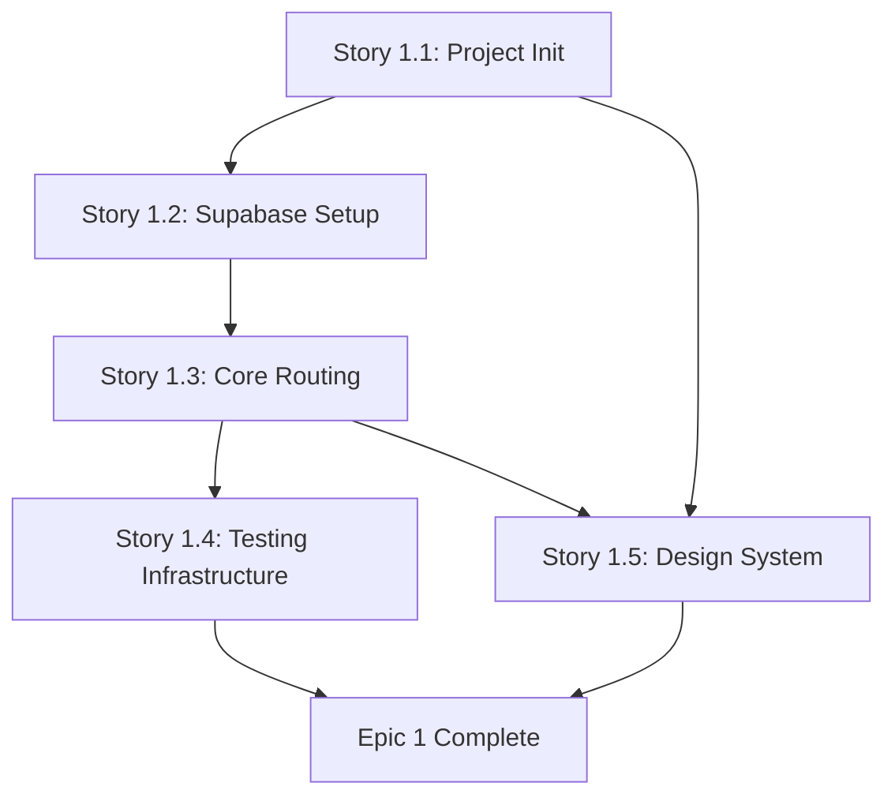

# Epic Technical Specification: Foundation & Infrastructure

Date: 2025-11-14
Author: Spardutti
Epic ID: epic-1
Status: Draft

---

## Overview

Epic 1 establishes the technical foundation for the entire sudoku-race application. This epic delivers the development environment, deployment pipeline, core infrastructure, and design system that all subsequent epics depend on.

**Key Deliverables:**
- Fully configured Next.js 16 application with TypeScript, Tailwind CSS 4, and code quality tools
- Supabase integration with complete database schema and Row Level Security policies
- Core app routing structure with responsive newspaper aesthetic layout
- Automated testing infrastructure with CI/CD quality gates via GitHub Actions
- Design system foundations with reusable UI components and accessibility standards

**Business Value:** Without this foundation, no other development can proceed. Epic 1 creates the deployable infrastructure, quality standards, and development patterns that enable rapid iteration from day one.

**Technical Scope:** This epic focuses on horizontal infrastructure concerns (deployment, database, testing, design system) that support vertical feature development in later epics. It includes no user-facing puzzle features—those begin in Epic 2.

## Objectives and Scope

### Primary Objectives

1. **Deployment Infrastructure**: Establish automated deployment pipeline via Vercel with environment configuration and preview/production environments
2. **Database Foundation**: Configure Supabase with complete schema, RLS policies, and authentication providers for all user data and puzzle management
3. **Development Environment**: Set up Next.js 16 with TypeScript strict mode, code quality tools, and project structure optimized for AI agent development
4. **Quality Assurance**: Implement automated testing (Jest, React Testing Library) with CI/CD gates ensuring code quality and preventing regressions
5. **Design Consistency**: Create design system with newspaper aesthetic foundations, reusable components, and accessibility compliance (WCAG AA)

### Scope Boundaries

**In Scope:**
- Project initialization and configuration (Story 1.1)
- Supabase integration and database schema creation (Story 1.2)
- Core routing structure and layout components (Story 1.3)
- Testing frameworks and CI/CD pipeline configuration (Story 1.4)
- Design system tokens, typography, and base UI components (Story 1.5)

**Out of Scope (Deferred to Later Epics):**
- Puzzle generation and daily puzzle system (Epic 2)
- User authentication flows and OAuth implementation (Epic 3)
- Leaderboard functionality and real-time updates (Epic 4)
- Social sharing and emoji grid generation (Epic 5)
- Streak tracking and statistics (Epic 6)

### Success Criteria

- ✅ "Hello World" page successfully deployed to Vercel production
- ✅ Supabase database accessible with all tables created and RLS enabled
- ✅ All routes render without errors (/, /auth/callback, /profile, /leaderboard)
- ✅ GitHub Actions CI pipeline passes on every PR (lint, test, build)
- ✅ Design system components documented and tested with 70%+ coverage

## System Architecture Alignment

Epic 1 implements the foundational architecture patterns defined in `/docs/architecture.md`:

### Frontend Layer (Next.js 16 + React 19)

**Alignment:** Implements the "Scale Adaptive Frontend" architecture (docs/architecture.md Section 2.1)

- **App Router Structure**: Using Next.js 16 App Router (not Pages Router) for RSC support and improved performance
- **Component Organization**: `/components/layout/` for shared layouts, `/components/ui/` for design system primitives
- **Type Safety**: TypeScript strict mode enforced across all components
- **Styling**: Tailwind CSS 4 with custom newspaper aesthetic theme extension

### Database Layer (Supabase PostgreSQL)

**Alignment:** Implements "Relational Data Model" architecture (docs/architecture.md Section 2.2)

- **Schema Creation**: All 5 core tables defined with foreign key relationships and indexes
  - `users`, `puzzles`, `completions`, `leaderboards`, `streaks`
- **Row Level Security**: RLS policies implemented for all tables per security architecture
- **Migration Strategy**: SQL migration files in version control for reproducible schema setup

### Authentication Layer (Supabase Auth)

**Alignment:** Preparation for "Guest-First Auth Journey" (docs/architecture.md Section 2.3)

- **OAuth Provider Configuration**: Google, GitHub, Apple enabled in Supabase dashboard
- **Redirect URLs**: Configured for both development and production environments
- **Session Management**: Supabase Auth SDK integrated for future auth flows (Epic 3)

### Deployment Architecture (Vercel)

**Alignment:** Implements "Progressive Deployment" pattern (docs/architecture.md Section 3.0)

- **Automatic Deployments**: Main branch → production, feature branches → preview URLs
- **Environment Variables**: Supabase credentials managed via Vercel environment config
- **Edge Network**: Vercel CDN for global static asset delivery

### Quality and Observability

**Alignment:** Establishes foundation for "Observability Stack" (docs/architecture.md Section 5.0)

- **CI/CD Pipeline**: GitHub Actions running lint, test, build on all PRs
- **Test Coverage**: Jest + React Testing Library with 70% minimum threshold
- **Future-Ready**: Infrastructure prepared for error tracking and monitoring (Story 1.6-1.9 approved additions)

## Detailed Design

### Services and Modules

#### 1.1 Project Structure and Configuration

**Directory Structure:**
```
/app                    # Next.js 16 App Router
  /layout.tsx          # Root layout with meta tags, fonts
  /page.tsx            # Home page (daily puzzle - placeholder for Epic 2)
  /auth
    /callback/route.ts # OAuth callback handler (foundation for Epic 3)
  /profile/page.tsx    # User profile page (placeholder)
  /leaderboard/page.tsx # Leaderboard page (placeholder)

/components
  /layout
    /Header.tsx        # Navigation header with mobile menu
    /Footer.tsx        # Site footer
  /ui                  # Design system components
    /Button.tsx
    /Card.tsx
    /Input.tsx
    /Typography.tsx
    /index.ts          # Barrel export

/lib
  /supabase.ts         # Supabase client initialization
  /design-tokens.ts    # Design system token definitions
  /utils.ts            # Shared utility functions

/types
  /database.ts         # Supabase auto-generated types
  /index.ts            # Application type definitions

/public                # Static assets
  /fonts              # Merriweather, Inter fonts
  /images             # Logo, OG image placeholders
```

**Configuration Files:**
- `next.config.js`: Next.js configuration with image optimization, security headers
- `tailwind.config.ts`: Custom newspaper aesthetic theme, design tokens
- `tsconfig.json`: TypeScript strict mode configuration
- `.eslintrc.json`: ESLint rules (Next.js recommended + strict)
- `.prettierrc`: Prettier formatting rules
- `jest.config.js`: Jest test runner configuration
- `.github/workflows/ci.yml`: GitHub Actions CI pipeline

#### 1.2 Supabase Integration Module

**File:** `/lib/supabase.ts`

```typescript
import { createClient } from '@supabase/supabase-js'
import type { Database } from '@/types/database'

const supabaseUrl = process.env.NEXT_PUBLIC_SUPABASE_URL!
const supabaseAnonKey = process.env.NEXT_PUBLIC_SUPABASE_ANON_KEY!

export const supabase = createClient<Database>(supabaseUrl, supabaseAnonKey)
```

**Environment Variables (`.env.local`):**
```
NEXT_PUBLIC_SUPABASE_URL=https://[project-id].supabase.co
NEXT_PUBLIC_SUPABASE_ANON_KEY=[anon-key]
```

#### 1.3 Layout Components

**Header Component (`/components/layout/Header.tsx`):**
- Newspaper-style branding ("Sudoku Daily")
- Navigation links: Today's Puzzle, Leaderboard, Profile
- Responsive hamburger menu for mobile (320px-767px)
- Auth state placeholder (will show "Sign In" button - implemented in Epic 3)

**Footer Component (`/components/layout/Footer.tsx`):**
- Copyright notice
- Links to Privacy Policy, Terms (placeholders)
- "Built with Claude Code" attribution

**Root Layout (`/app/layout.tsx`):**
- HTML structure with proper meta tags (SEO foundation)
- Google Fonts preloading (Merriweather, Inter)
- Tailwind CSS imported
- Persistent layout with Header and Footer

#### 1.4 Testing Infrastructure

**Jest Configuration (`jest.config.js`):**
```javascript
module.exports = {
  preset: 'next/jest',
  testEnvironment: 'jest-environment-jsdom',
  collectCoverageFrom: [
    'app/**/*.{ts,tsx}',
    'components/**/*.{ts,tsx}',
    'lib/**/*.{ts,tsx}',
    '!**/*.test.{ts,tsx}',
    '!**/*.config.ts',
  ],
  coverageThreshold: {
    global: {
      lines: 70,
      statements: 70,
      functions: 70,
      branches: 70,
    },
  },
}
```

**CI/CD Pipeline (`.github/workflows/ci.yml`):**
```yaml
name: CI
on: [push, pull_request]
jobs:
  quality:
    runs-on: ubuntu-latest
    steps:
      - uses: actions/checkout@v3
      - uses: actions/setup-node@v3
        with:
          node-version: '20'
      - run: npm ci
      - run: npm run lint
      - run: npm test -- --coverage
      - run: npm run build
```

#### 1.5 Design System Module

**Design Tokens (`/lib/design-tokens.ts`):**
```typescript
export const designTokens = {
  colors: {
    primary: '#000000',      // Black
    background: '#FFFFFF',   // White
    accent: '#1a73e8',       // Blue (spot color)
    success: '#0f9d58',      // Green
    neutral: '#757575',      // Gray
  },
  typography: {
    fontFamily: {
      serif: ['Merriweather', 'Georgia', 'serif'],
      sans: ['Inter', 'system-ui', 'sans-serif'],
    },
    scale: {
      xs: '0.75rem',   // 12px
      sm: '0.875rem',  // 14px
      base: '1rem',    // 16px
      lg: '1.125rem',  // 18px
      xl: '1.25rem',   // 20px
      '2xl': '1.5rem', // 24px
      '3xl': '1.875rem', // 30px
    },
  },
  spacing: {
    // 8px grid system
    0: '0',
    1: '0.5rem',  // 8px
    2: '1rem',    // 16px
    3: '1.5rem',  // 24px
    4: '2rem',    // 32px
    // ... extends to 16
  },
}
```

**Base UI Components:**
- `Button`: Primary, secondary, ghost variants with accessible focus states
- `Card`: Clean card container with newspaper aesthetic borders
- `Input`: Text input with validation states and ARIA labels
- `Typography`: Heading, body, caption variants (responsive scale)

All components follow:
- TypeScript prop interfaces
- WCAG AA accessibility (4.5:1 contrast, keyboard support)
- Minimum 44x44px touch targets (mobile)
- Unit tests with React Testing Library

### Data Models and Contracts

#### Database Schema (Supabase PostgreSQL)

Epic 1 establishes the complete database schema for all application features. All tables created in Story 1.2.

**Schema Migration File:** `/supabase/migrations/001_initial_schema.sql`

##### Table: `users`

Stores authenticated user accounts (OAuth-based).

```sql
CREATE TABLE users (
  id UUID PRIMARY KEY DEFAULT uuid_generate_v4(),
  email TEXT NOT NULL UNIQUE,
  username TEXT NOT NULL,
  oauth_provider TEXT NOT NULL, -- 'google' | 'github' | 'apple'
  created_at TIMESTAMPTZ NOT NULL DEFAULT NOW(),
  updated_at TIMESTAMPTZ NOT NULL DEFAULT NOW()
);

-- RLS Policy
ALTER TABLE users ENABLE ROW LEVEL SECURITY;

CREATE POLICY "Users can read own data"
  ON users FOR SELECT
  USING (auth.uid() = id);

CREATE POLICY "Users can update own data"
  ON users FOR UPDATE
  USING (auth.uid() = id);
```

##### Table: `puzzles`

Stores daily Sudoku puzzles (one per day, globally shared).

```sql
CREATE TABLE puzzles (
  id UUID PRIMARY KEY DEFAULT uuid_generate_v4(),
  puzzle_date DATE NOT NULL UNIQUE, -- Daily puzzle identifier (UTC)
  puzzle_data JSONB NOT NULL,       -- 9x9 array with 0 for empty cells
  difficulty TEXT NOT NULL,         -- 'medium' for MVP
  solution JSONB NOT NULL,          -- Complete solution (never sent to client)
  created_at TIMESTAMPTZ NOT NULL DEFAULT NOW()
);

CREATE INDEX idx_puzzles_date ON puzzles(puzzle_date);

-- RLS Policy
ALTER TABLE puzzles ENABLE ROW LEVEL SECURITY;

CREATE POLICY "Puzzles are publicly readable"
  ON puzzles FOR SELECT
  USING (true);
```

**Note:** `solution` field NEVER exposed to client—used only for server-side validation.

##### Table: `completions`

Tracks user puzzle completions (in-progress and finished).

```sql
CREATE TABLE completions (
  id UUID PRIMARY KEY DEFAULT uuid_generate_v4(),
  user_id UUID REFERENCES users(id) ON DELETE CASCADE,
  puzzle_id UUID REFERENCES puzzles(id) ON DELETE CASCADE,
  completion_time_seconds INT,    -- NULL if in-progress
  completed_at TIMESTAMPTZ,       -- NULL if in-progress
  is_guest BOOLEAN DEFAULT false, -- For future guest tracking
  completion_data JSONB,          -- Stores in-progress grid state
  solve_path JSONB,               -- Cell-by-cell solve history (Epic 5)
  started_at TIMESTAMPTZ NOT NULL DEFAULT NOW(),
  UNIQUE(user_id, puzzle_id)      -- One completion per user per puzzle
);

CREATE INDEX idx_completions_user ON completions(user_id);
CREATE INDEX idx_completions_puzzle ON completions(puzzle_id);

-- RLS Policy
ALTER TABLE completions ENABLE ROW LEVEL SECURITY;

CREATE POLICY "Users can read own completions"
  ON completions FOR SELECT
  USING (auth.uid() = user_id);

CREATE POLICY "Users can insert own completions"
  ON completions FOR INSERT
  WITH CHECK (auth.uid() = user_id);

CREATE POLICY "Users can update own completions"
  ON completions FOR UPDATE
  USING (auth.uid() = user_id);
```

##### Table: `leaderboards`

Stores leaderboard rankings for each daily puzzle.

```sql
CREATE TABLE leaderboards (
  id UUID PRIMARY KEY DEFAULT uuid_generate_v4(),
  puzzle_id UUID REFERENCES puzzles(id) ON DELETE CASCADE,
  user_id UUID REFERENCES users(id) ON DELETE CASCADE,
  rank INT NOT NULL,
  completion_time_seconds INT NOT NULL,
  submitted_at TIMESTAMPTZ NOT NULL DEFAULT NOW(),
  UNIQUE(puzzle_id, user_id)
);

CREATE INDEX idx_leaderboards_puzzle_time ON leaderboards(puzzle_id, completion_time_seconds);
CREATE INDEX idx_leaderboards_user ON leaderboards(user_id);

-- RLS Policy
ALTER TABLE leaderboards ENABLE ROW LEVEL SECURITY;

CREATE POLICY "Leaderboards are publicly readable"
  ON leaderboards FOR SELECT
  USING (true);
```

##### Table: `streaks`

Tracks user streaks for retention features.

```sql
CREATE TABLE streaks (
  id UUID PRIMARY KEY DEFAULT uuid_generate_v4(),
  user_id UUID REFERENCES users(id) ON DELETE CASCADE UNIQUE,
  current_streak INT NOT NULL DEFAULT 1,
  longest_streak INT NOT NULL DEFAULT 1,
  last_completion_date DATE NOT NULL,
  freeze_available BOOLEAN DEFAULT true,
  last_freeze_reset_date DATE,
  UNIQUE(user_id)
);

CREATE INDEX idx_streaks_user ON streaks(user_id);

-- RLS Policy
ALTER TABLE streaks ENABLE ROW LEVEL SECURITY;

CREATE POLICY "Users can read own streaks"
  ON streaks FOR SELECT
  USING (auth.uid() = user_id);
```

#### TypeScript Type Definitions

**Auto-Generated from Supabase:** `/types/database.ts`

```typescript
export type Database = {
  public: {
    Tables: {
      users: {
        Row: {
          id: string
          email: string
          username: string
          oauth_provider: 'google' | 'github' | 'apple'
          created_at: string
          updated_at: string
        }
        Insert: {
          id?: string
          email: string
          username: string
          oauth_provider: 'google' | 'github' | 'apple'
          created_at?: string
          updated_at?: string
        }
        Update: {
          id?: string
          email?: string
          username?: string
          oauth_provider?: 'google' | 'github' | 'apple'
          updated_at?: string
        }
      }
      // ... similar for puzzles, completions, leaderboards, streaks
    }
  }
}
```

**Manual Type Definitions:** `/types/index.ts`

```typescript
// Puzzle grid: 9x9 array, 0 = empty cell, 1-9 = filled
export type PuzzleGrid = number[][]

// Solve path entry (Epic 5)
export type SolvePathEntry = {
  row: number
  col: number
  number: number
  timestamp: number
  isCorrection: boolean
}

// Component prop types
export type ButtonVariant = 'primary' | 'secondary' | 'ghost'
export type TypographyVariant = 'h1' | 'h2' | 'h3' | 'body' | 'caption'
```

### APIs and Interfaces

Epic 1 establishes foundational routes but defers most API logic to later epics. The focus is on routing structure and placeholder pages.

#### Next.js App Router Routes

**Route: `/` (Home Page)**
- **File:** `/app/page.tsx`
- **Type:** Server Component (Next.js 16 RSC)
- **Purpose:** Placeholder for daily puzzle page (Epic 2)
- **Epic 1 Implementation:** Simple "Coming Soon - Daily Sudoku" page with newspaper aesthetic
- **Future:** Will fetch today's puzzle and render SudokuGrid component

**Route: `/auth/callback` (OAuth Callback Handler)**
- **File:** `/app/auth/callback/route.ts`
- **Type:** Route Handler (API route)
- **Purpose:** Handle OAuth callback from Supabase Auth
- **Epic 1 Implementation:** Foundation only—imports Supabase client, prepares structure
- **Future:** Epic 3 will implement session handling and redirect logic

```typescript
// Epic 1 placeholder
import { NextResponse } from 'next/server'

export async function GET(request: Request) {
  // TODO: Epic 3 - Handle OAuth callback
  return NextResponse.redirect(new URL('/', request.url))
}
```

**Route: `/profile` (User Profile Page)**
- **File:** `/app/profile/page.tsx`
- **Type:** Server Component
- **Purpose:** User account management and stats
- **Epic 1 Implementation:** Placeholder page with "Profile Coming Soon" message
- **Future:** Epic 3 (auth), Epic 6 (stats dashboard)

**Route: `/leaderboard` (Global Leaderboard)**
- **File:** `/app/leaderboard/page.tsx`
- **Type:** Server Component
- **Purpose:** Display daily puzzle rankings
- **Epic 1 Implementation:** Placeholder page with newspaper-style "Leaderboard Coming Soon"
- **Future:** Epic 4 will implement leaderboard queries and real-time updates

#### Supabase Client Interface

**Initialization Pattern:**

```typescript
// /lib/supabase.ts
import { createClient } from '@supabase/supabase-js'
import type { Database } from '@/types/database'

const supabaseUrl = process.env.NEXT_PUBLIC_SUPABASE_URL!
const supabaseAnonKey = process.env.NEXT_PUBLIC_SUPABASE_ANON_KEY!

export const supabase = createClient<Database>(supabaseUrl, supabaseAnonKey, {
  auth: {
    persistSession: true,
    autoRefreshToken: true,
  },
})
```

**Usage Pattern (for future epics):**

```typescript
// Example: Fetch today's puzzle (Epic 2)
const { data, error } = await supabase
  .from('puzzles')
  .select('*')
  .eq('puzzle_date', todayUTC)
  .single()
```

#### Component Interfaces (Design System)

**Button Component:**

```typescript
// /components/ui/Button.tsx
export interface ButtonProps {
  variant?: 'primary' | 'secondary' | 'ghost'
  size?: 'sm' | 'md' | 'lg'
  disabled?: boolean
  onClick?: () => void
  children: React.ReactNode
  type?: 'button' | 'submit' | 'reset'
  ariaLabel?: string
}

export function Button({
  variant = 'primary',
  size = 'md',
  ...props
}: ButtonProps) {
  // Implementation
}
```

**Card Component:**

```typescript
// /components/ui/Card.tsx
export interface CardProps {
  children: React.ReactNode
  className?: string
  padding?: 'sm' | 'md' | 'lg'
}
```

**Input Component:**

```typescript
// /components/ui/Input.tsx
export interface InputProps {
  type?: 'text' | 'email' | 'password'
  placeholder?: string
  value?: string
  onChange?: (e: React.ChangeEvent<HTMLInputElement>) => void
  error?: string
  ariaLabel: string
  required?: boolean
}
```

**Typography Component:**

```typescript
// /components/ui/Typography.tsx
export interface TypographyProps {
  variant: 'h1' | 'h2' | 'h3' | 'body' | 'caption'
  children: React.ReactNode
  className?: string
  as?: 'h1' | 'h2' | 'h3' | 'p' | 'span'
}
```

#### No External APIs in Epic 1

Epic 1 does not integrate external APIs beyond Supabase. Future epics may add:
- Puzzle generation APIs (if not using local generation)
- Analytics/monitoring services (Vercel Analytics, Sentry)
- Email services (for notifications - post-MVP)

### Workflows and Sequencing

Epic 1 stories must be executed in order due to dependencies. Each story builds on previous infrastructure.

#### Story Execution Sequence



**Story 1.1: Project Initialization** (No dependencies)
- Initialize Next.js 16 project with React 19
- Configure TypeScript, Tailwind CSS 4, ESLint, Prettier
- Set up Vercel deployment
- Create basic project structure
- Deploy "Hello World" to verify pipeline

**Story 1.2: Supabase Integration** (Depends on 1.1)
- **Prerequisite:** Environment variables configured in Story 1.1
- Create Supabase project (free tier)
- Create all 5 database tables with RLS policies
- Configure OAuth providers (Google, GitHub, Apple) in dashboard
- Install `@supabase/supabase-js` and create `/lib/supabase.ts`
- Test database connection

**Story 1.3: Core App Routing** (Depends on 1.1)
- **Prerequisite:** Next.js project structure from Story 1.1
- Create `/app/layout.tsx` root layout
- Create Header and Footer components
- Create 4 placeholder pages (/, /auth/callback, /profile, /leaderboard)
- Apply newspaper aesthetic styling
- Test all routes render without errors

**Story 1.4: Testing Infrastructure** (Depends on 1.1, 1.3)
- **Prerequisites:**
  - Project structure from 1.1
  - Components from 1.3 to test against
- Install Jest, React Testing Library
- Configure `jest.config.js` with coverage thresholds
- Create example tests (utility function, layout component)
- Set up GitHub Actions CI/CD pipeline
- Verify tests pass in CI

**Story 1.5: Design System Foundations** (Depends on 1.1, 1.3)
- **Prerequisites:**
  - Tailwind CSS from 1.1
  - Layout structure from 1.3
- Define design tokens in `tailwind.config.ts`
- Create 4 base UI components (Button, Card, Input, Typography)
- Write unit tests for all components (70%+ coverage)
- Create example page demonstrating component usage
- Document component props and usage

#### Parallel Execution Opportunities

While stories must be completed sequentially, some work can be parallelized within stories:

**Story 1.2 (Supabase Setup):**
- Table creation can be done in single migration (all 5 tables at once)
- OAuth provider configuration can be done in parallel (Google, GitHub, Apple simultaneously)

**Story 1.5 (Design System):**
- UI components (Button, Card, Input, Typography) can be built in parallel by different dev agents
- Tests can be written concurrently with component implementation

#### Development Workflow Pattern

For each story, follow this workflow:

1. **Context Loading**: Read previous story outputs and architecture docs
2. **Implementation**: Write code following TypeScript strict mode and ESLint rules
3. **Testing**: Write unit tests (min 70% coverage for new code)
4. **Verification**: Run `npm run lint && npm test && npm run build` locally
5. **Commit**: Commit to feature branch
6. **CI Validation**: GitHub Actions runs quality gates
7. **Merge**: Merge to main after CI passes
8. **Deploy**: Automatic deployment to Vercel production

#### Story Completion Checklist

Each story is considered complete when:
- ✅ All acceptance criteria met (see Acceptance Criteria section)
- ✅ Unit tests written and passing (70%+ coverage)
- ✅ ESLint and Prettier checks passing
- ✅ TypeScript compiles with no errors (strict mode)
- ✅ Next.js build succeeds (`npm run build`)
- ✅ GitHub Actions CI pipeline passing
- ✅ Changes deployed to Vercel production
- ✅ Manual verification of deployed feature

## Non-Functional Requirements

### Performance

Epic 1 establishes performance foundations that all future epics build upon.

**Load Time Targets:**
- **First Contentful Paint (FCP)**: <1.5s on 3G connection
- **Largest Contentful Paint (LCP)**: <2.5s on 3G connection
- **Time to Interactive (TTI)**: <3s on 3G connection
- **Cumulative Layout Shift (CLS)**: <0.1 (minimal layout shift)

**Implementation Strategies:**
- Next.js 16 Server Components for reduced client-side JavaScript
- Font preloading (Merriweather, Inter) to prevent FOIT (Flash of Invisible Text)
- Image optimization via Next.js Image component (when images added)
- Tailwind CSS purging to minimize CSS bundle size
- No client-side runtime dependencies beyond React/Next.js essentials

**Build Size Targets:**
- Initial JavaScript bundle: <150KB gzipped
- CSS bundle: <20KB gzipped
- Total page weight (homepage): <300KB

**Database Performance:**
- Supabase free tier: 500MB database, sufficient for MVP
- Indexes created on all foreign keys and frequently queried columns
- RLS policies optimized to avoid full table scans

**Vercel Deployment:**
- Edge network caching for static assets (CDN)
- Automatic compression (Brotli/Gzip)
- HTTP/2 server push for critical resources

### Security

Epic 1 implements defense-in-depth security from day one.

**Database Security (Supabase):**
- **Row Level Security (RLS)**: Enabled on ALL tables
- **RLS Policies**:
  - Users can only read/update own data
  - Puzzles and leaderboards publicly readable (no sensitive data)
  - Completions and streaks restricted to owning user
- **SQL Injection Prevention**: Supabase client uses parameterized queries
- **Database Credentials**: Never exposed to client (anon key only)

**Authentication Security (Foundation for Epic 3):**
- OAuth-only authentication (no password storage vulnerability)
- Supabase Auth handles session management securely
- Session tokens stored in httpOnly cookies (not localStorage)
- CSRF protection via Supabase Auth built-in mechanisms

**Application Security:**
- **TypeScript Strict Mode**: Prevents type-related vulnerabilities
- **Content Security Policy (CSP)**: Set in Next.js config
  ```javascript
  // next.config.js
  headers: [
    {
      key: 'Content-Security-Policy',
      value: "default-src 'self'; script-src 'self' 'unsafe-inline'; style-src 'self' 'unsafe-inline';"
    }
  ]
  ```
- **HTTPS Only**: Vercel enforces HTTPS, HTTP redirects automatically
- **Secure Headers**: X-Frame-Options, X-Content-Type-Options, Referrer-Policy

**Dependency Security:**
- Dependabot enabled for automated vulnerability alerts
- `npm audit` runs in CI pipeline (blocks merge on high/critical vulnerabilities)
- Minimal dependencies to reduce attack surface

**Environment Variable Security:**
- Secrets stored in Vercel environment variables (not in git)
- `.env.local` in `.gitignore`
- Separate environments for development and production

### Reliability/Availability

**Vercel Deployment Architecture:**
- **Uptime SLA**: 99.9% (Vercel standard)
- **Multi-Region**: Automatic global edge network deployment
- **Automatic Failover**: Vercel edge network handles node failures
- **Zero-Downtime Deploys**: Atomic deployments with instant rollback capability

**Database Reliability (Supabase):**
- **Uptime SLA**: 99.9% (Supabase free tier)
- **Automatic Backups**: Daily backups included
- **Connection Pooling**: Supabase Supavisor handles connection management
- **Read Replicas**: Available if needed (post-MVP upgrade)

**Error Handling Foundations:**
- React Error Boundaries for client-side error containment
- Next.js error pages (404, 500) with newspaper aesthetic
- Graceful degradation for failed API calls (loading skeletons, retry buttons)

**Monitoring Readiness:**
- Infrastructure prepared for error tracking (Story 1.6-1.9 approved additions)
- Future integration: Sentry for error tracking, Vercel Analytics for performance

**CI/CD Reliability:**
- GitHub Actions with retry logic for flaky tests
- Build failures block deployment (quality gate)
- Preview deployments for every PR (safe testing before production)

### Observability

Epic 1 establishes observability foundations for future monitoring.

**Logging:**
- Next.js server-side logs visible in Vercel dashboard
- Client-side errors logged to console (post-MVP: send to error tracking service)
- Structured logging format for easier parsing

**Build Observability:**
- GitHub Actions CI logs for every build
- Test coverage reports generated and stored
- Build success/failure visible in PR checks

**Deployment Observability:**
- Vercel deployment logs and build analytics
- Preview deployment URLs for manual verification
- Production deployment notifications (Vercel integrations)

**Future Observability (Post-Epic 1):**
- **Error Tracking**: Sentry integration (Story 1.6)
- **Performance Monitoring**: Vercel Analytics, Web Vitals tracking
- **Database Monitoring**: Supabase dashboard metrics (query performance, connection count)
- **User Analytics**: Privacy-focused analytics (Plausible or similar)

**Testing Observability:**
- Jest coverage reports (70% threshold enforced)
- CI pipeline reports test failures with detailed output
- Coverage trending over time (via GitHub Actions artifacts)

## Dependencies and Integrations

### External Service Dependencies

**Vercel (Deployment Platform):**
- **Purpose**: Hosting, CI/CD, edge network
- **Tier**: Free tier (hobby plan)
- **Setup**: Connect GitHub repository, configure environment variables
- **Limits**: Sufficient for MVP (100GB bandwidth/month, unlimited deployments)
- **Risk**: Low (industry-standard platform, 99.9% uptime SLA)

**Supabase (Backend-as-a-Service):**
- **Purpose**: PostgreSQL database, authentication, real-time subscriptions
- **Tier**: Free tier
- **Setup**: Create project, configure OAuth apps, run migrations
- **Limits**: 500MB database, 2GB bandwidth/month, 50MB file storage
- **Risk**: Low (Supabase is stable, backed by Y Combinator)
- **Future Scaling**: Can upgrade to Pro tier ($25/month) for 8GB database, 50GB bandwidth

**Google Fonts (Typography):**
- **Purpose**: Merriweather (serif), Inter (sans-serif) fonts
- **Tier**: Free
- **Setup**: Preload fonts in `/app/layout.tsx`
- **Limits**: None
- **Risk**: Very low (Google Fonts CDN, 99.9% uptime)

### NPM Dependencies

**Core Framework:**
```json
{
  "dependencies": {
    "next": "^16.0.0",
    "react": "^19.0.0",
    "react-dom": "^19.0.0",
    "@supabase/supabase-js": "^2.39.0",
    "tailwindcss": "^4.0.0"
  }
}
```

**Development Dependencies:**
```json
{
  "devDependencies": {
    "@types/node": "^20.0.0",
    "@types/react": "^19.0.0",
    "typescript": "^5.3.0",
    "eslint": "^8.56.0",
    "eslint-config-next": "^16.0.0",
    "prettier": "^3.2.0",
    "jest": "^29.7.0",
    "@testing-library/react": "^14.1.0",
    "@testing-library/jest-dom": "^6.1.0",
    "jest-environment-jsdom": "^29.7.0"
  }
}
```

**Total Dependency Count:** ~30 packages (including transitive dependencies)
- **Security**: All dependencies scanned via `npm audit` in CI
- **Updates**: Dependabot monitors for vulnerability patches
- **Lockfile**: `package-lock.json` committed to ensure reproducible builds

### Internal Module Dependencies

**Story 1.1 Outputs (used by all other stories):**
- Next.js project structure
- TypeScript configuration
- Tailwind CSS configuration
- Environment variable setup
- Vercel deployment configuration

**Story 1.2 Outputs (used by Epic 2, 3, 4, 5, 6):**
- Supabase client (`/lib/supabase.ts`)
- Database schema (all 5 tables)
- TypeScript database types (`/types/database.ts`)

**Story 1.3 Outputs (used by all future pages):**
- Root layout with Header/Footer
- Routing structure
- Page templates

**Story 1.4 Outputs (used by all development):**
- Jest configuration
- GitHub Actions CI pipeline
- Testing utilities

**Story 1.5 Outputs (used by all UI development):**
- Design tokens (`/lib/design-tokens.ts`)
- Base UI components (Button, Card, Input, Typography)
- Tailwind theme configuration

### Integration Points for Future Epics

**Epic 2 (Core Puzzle Experience):**
- Depends on: Supabase client, database schema (puzzles, completions tables)
- Depends on: Design system components (Grid component will use Card, Button)
- Depends on: Layout structure (puzzle page uses root layout)

**Epic 3 (User Identity & Authentication):**
- Depends on: Supabase Auth configuration (OAuth providers)
- Depends on: Database schema (users table)
- Depends on: Auth callback route foundation (`/auth/callback`)

**Epic 4 (Competitive Leaderboards):**
- Depends on: Database schema (leaderboards, completions tables)
- Depends on: Design system (leaderboard table styling)

**Epic 5 (Viral Social Mechanics):**
- Depends on: Completions data (solve_path field)
- Depends on: Design system (share modal components)

**Epic 6 (Engagement & Retention):**
- Depends on: Database schema (streaks table)
- Depends on: Design system (stats cards, calendar component)

### No External API Integrations in Epic 1

Epic 1 does not integrate third-party APIs beyond infrastructure services (Vercel, Supabase, Google Fonts). Future integrations may include:
- **Post-MVP**: Sentry (error tracking)
- **Post-MVP**: Vercel Analytics (performance monitoring)
- **Post-MVP**: Email service (SendGrid, Resend) for notifications

## Acceptance Criteria (Authoritative)

This section consolidates all acceptance criteria from Epic 1 stories. These are the authoritative requirements for story completion.

### Story 1.1: Project Initialization & Core Infrastructure

**AC-1.1.1: Next.js Project Configuration**
- ✅ Next.js 16 project initialized with React 19
- ✅ TypeScript strict mode enabled (`tsconfig.json`)
- ✅ Tailwind CSS 4 installed and configured
- ✅ ESLint and Prettier configured with Next.js recommended rules
- ✅ Git repository initialized with `.gitignore` configured

**AC-1.1.2: Environment Management**
- ✅ `.env.local` file created with Supabase placeholders
- ✅ `.env.local` added to `.gitignore`
- ✅ Environment variable documentation in README

**AC-1.1.3: Vercel Deployment**
- ✅ Project connected to Vercel
- ✅ Automatic deployments on push to main branch
- ✅ Preview deployments for feature branches
- ✅ Environment variables configured in Vercel dashboard

**AC-1.1.4: Project Structure**
- ✅ Directory structure created:
  - `/app` - Next.js App Router
  - `/components` - React components
  - `/lib` - Utility functions
  - `/types` - TypeScript definitions
  - `/public` - Static assets

**AC-1.1.5: Hello World Deployment**
- ✅ Basic "Hello World" page renders at `/`
- ✅ Page successfully deployed to Vercel production
- ✅ Production URL accessible and loads correctly

### Story 1.2: Supabase Integration & Database Setup

**AC-1.2.1: Supabase Project Setup**
- ✅ Supabase project created (free tier)
- ✅ `@supabase/supabase-js` installed
- ✅ Supabase URL and anon key in environment variables
- ✅ Supabase client utility created (`/lib/supabase.ts`)
- ✅ Connection tested and verified

**AC-1.2.2: Database Schema Creation**
- ✅ All 5 tables created:
  - `users` (id, email, username, oauth_provider, created_at, updated_at)
  - `puzzles` (id, puzzle_date, puzzle_data, difficulty, solution, created_at)
  - `completions` (id, user_id, puzzle_id, completion_time_seconds, completed_at, is_guest, completion_data, solve_path, started_at)
  - `leaderboards` (id, puzzle_id, user_id, rank, completion_time_seconds, submitted_at)
  - `streaks` (id, user_id, current_streak, longest_streak, last_completion_date, freeze_available, last_freeze_reset_date)

**AC-1.2.3: Row Level Security (RLS)**
- ✅ RLS enabled on all tables
- ✅ RLS policies created:
  - Users can read/update own data only
  - Puzzles publicly readable
  - Leaderboards publicly readable
  - Completions restricted to owning user
  - Streaks restricted to owning user

**AC-1.2.4: Database Indexes**
- ✅ Index on `puzzles.puzzle_date`
- ✅ Index on `leaderboards.puzzle_id, completion_time_seconds`
- ✅ Index on `completions.user_id`
- ✅ Index on `completions.puzzle_id`
- ✅ Index on `streaks.user_id`

**AC-1.2.5: Supabase Auth Configuration**
- ✅ OAuth providers enabled (Google, GitHub, Apple) in Supabase dashboard
- ✅ Redirect URLs configured:
  - `http://localhost:3000/auth/callback` (development)
  - `https://[production-url]/auth/callback` (production)

**AC-1.2.6: Database Documentation**
- ✅ Database migration file created (`/supabase/migrations/001_initial_schema.sql`)
- ✅ Migration file committed to version control

### Story 1.3: Core App Routing & Layout Structure

**AC-1.3.1: Route Structure**
- ✅ Routes exist and render:
  - `/` - Home page (daily puzzle placeholder)
  - `/auth/callback` - OAuth callback handler (foundation)
  - `/profile` - User profile (placeholder)
  - `/leaderboard` - Global leaderboard (placeholder)

**AC-1.3.2: Root Layout**
- ✅ `/app/layout.tsx` includes:
  - HTML structure with proper meta tags
  - Newspaper aesthetic typography (serif headers, sans-serif body)
  - Responsive viewport configuration
  - Layout persists across page navigation

**AC-1.3.3: Navigation Header Component**
- ✅ "Sudoku Daily" branding (newspaper style)
- ✅ Navigation links (Today's Puzzle, Leaderboard, Profile)
- ✅ Responsive mobile menu (hamburger on screens <768px)
- ✅ Black & white newspaper aesthetic applied

**AC-1.3.4: Footer Component**
- ✅ Links to Privacy Policy, Terms (placeholders)
- ✅ "Built with Claude Code" attribution
- ✅ Copyright notice

**AC-1.3.5: 404 Page**
- ✅ Custom 404 page created with newspaper aesthetic
- ✅ 404 page includes navigation back to home

### Story 1.4: Testing Infrastructure & CI/CD Quality Gates

**AC-1.4.1: Test Framework Configuration**
- ✅ Jest installed and configured
- ✅ React Testing Library installed
- ✅ `jest.config.js` created with coverage thresholds (70%)
- ✅ Test environment set to jsdom

**AC-1.4.2: NPM Scripts**
- ✅ `npm test` - Run all unit tests
- ✅ `npm run test:watch` - Watch mode for development
- ✅ `npm run test:coverage` - Generate coverage report
- ✅ `npm run lint` - ESLint check
- ✅ `npm run format` - Prettier format

**AC-1.4.3: GitHub Actions Workflow**
- ✅ `.github/workflows/ci.yml` created
- ✅ Runs on every PR and push to main
- ✅ Executes: `npm run lint`, `npm test`, `npm run build`
- ✅ Blocks merge if any step fails
- ✅ Runs in parallel for speed

**AC-1.4.4: Example Tests**
- ✅ Unit test for utility function
- ✅ Component test for reusable UI component
- ✅ All tests pass in CI/CD pipeline

**AC-1.4.5: Coverage Threshold**
- ✅ Coverage threshold configured (70% minimum)
- ✅ Coverage report excludes test files and config files

### Story 1.5: Design System Foundations (Newspaper Aesthetic)

**AC-1.5.1: Tailwind Configuration**
- ✅ `tailwind.config.ts` includes:
  - Custom color palette (black, white, spot blue, neutrals)
  - Typography scale (serif for headers, sans-serif for body)
  - Spacing system based on 8px grid
  - Responsive breakpoints (mobile 320-767px, tablet 768-1024px, desktop 1025px+)

**AC-1.5.2: Design Tokens**
- ✅ `/lib/design-tokens.ts` created with:
  - Colors: primary (#000000), background (#FFFFFF), accent (#1a73e8), success (#0f9d58), neutral (#757575)
  - Typography: Merriweather (serif), Inter (sans-serif)
  - Spacing scale (8px grid)

**AC-1.5.3: Reusable UI Components**
- ✅ Components created in `/components/ui/`:
  - `<Button>` - Primary, secondary, ghost variants
  - `<Card>` - Clean card with newspaper aesthetic
  - `<Input>` - Text input with focus states
  - `<Typography>` - Heading, body, caption variants

**AC-1.5.4: Component Requirements**
- ✅ Each component has:
  - TypeScript props interface
  - Accessible attributes (ARIA labels, keyboard support)
  - Responsive design (mobile-first)
  - Unit tests (coverage >70%)

**AC-1.5.5: Accessibility Standards**
- ✅ Color contrast meets WCAG AA (4.5:1 for text, 3:1 for UI)
- ✅ Mobile tap targets minimum 44x44px
- ✅ Keyboard navigation supported
- ✅ Screen reader compatible

**AC-1.5.6: Documentation**
- ✅ Component usage documented in JSDoc comments
- ✅ Barrel export created (`/components/ui/index.ts`)

### Epic 1 Completion Criteria

Epic 1 is considered complete when:
- ✅ All 5 stories completed (all acceptance criteria met)
- ✅ "Hello World" page deployed and accessible at production URL
- ✅ Supabase database accessible with all tables and RLS policies
- ✅ GitHub Actions CI pipeline passing
- ✅ Test coverage ≥70% for all new code
- ✅ All routes render without errors
- ✅ Design system components documented and tested

## Traceability Mapping

This section maps Epic 1 stories to PRD functional requirements and architecture decisions.

### Epic 1 → PRD Requirements

**Story 1.1 (Project Init):**
- Supports **ALL functional requirements** by establishing development foundation
- Enables **FR-9.1** (Mobile-first responsive design - Tailwind CSS responsive configuration)
- Enables **FR-9.2** (Accessibility standards - project structure for WCAG compliance)

**Story 1.2 (Supabase Setup):**
- **FR-1.1** (Daily puzzle generation) → `puzzles` table schema
- **FR-1.2** (Persistent puzzle state) → `completions` table schema
- **FR-4.1** (Guest play) → Database foundation for guest/auth distinction
- **FR-4.2** (OAuth authentication) → Supabase Auth configuration
- **FR-4.3** (Session preservation) → `users` table, auth infrastructure
- **FR-5.1** (Global leaderboard) → `leaderboards` table schema
- **FR-5.2** (Real-time updates) → Supabase Realtime foundation
- **FR-6.1** (Streak tracking) → `streaks` table schema
- **FR-8.1** (Personal statistics) → `completions` table for stats calculation

**Story 1.3 (Core Routing):**
- **FR-2.1** (Sudoku grid UI) → Route structure for puzzle page
- **FR-9.1** (Responsive design) → Mobile-first layout implementation
- Enables **ALL features** by providing navigation structure

**Story 1.4 (Testing):**
- **FR-9.2** (Accessibility) → Testing infrastructure to validate WCAG compliance
- Quality assurance for **ALL functional requirements**

**Story 1.5 (Design System):**
- **FR-9.1** (Newspaper aesthetic) → Design tokens, typography, component styling
- **FR-2.1** (Sudoku grid UI) → Base components (Card, Button) for grid implementation
- **FR-9.2** (Accessibility) → WCAG AA-compliant components

### Epic 1 → Architecture Decisions

**Story 1.1 → Architecture Section 2.1 (Frontend):**
- ✅ Next.js 16 App Router (RSC support)
- ✅ TypeScript strict mode (type safety)
- ✅ Tailwind CSS (utility-first styling)

**Story 1.2 → Architecture Section 2.2 (Database):**
- ✅ Supabase PostgreSQL (relational data model)
- ✅ Row Level Security (security architecture)
- ✅ Database indexes (performance optimization)

**Story 1.2 → Architecture Section 2.3 (Auth):**
- ✅ Supabase Auth (OAuth providers)
- ✅ Guest-first journey foundation

**Story 1.1 → Architecture Section 3.0 (Deployment):**
- ✅ Vercel deployment (progressive deployment pattern)
- ✅ Automatic deployments (CI/CD pipeline)

**Story 1.4 → Architecture Section 5.0 (Observability):**
- ✅ CI/CD pipeline (GitHub Actions)
- ✅ Test coverage monitoring (Jest reports)

**Story 1.5 → Architecture Section 2.1.3 (Design Patterns):**
- ✅ Component-driven development (reusable UI primitives)
- ✅ Accessibility-first design (WCAG AA compliance)

### Story Dependencies (Internal Traceability)

```
Story 1.1 (Project Init)
  ├─→ Story 1.2 (Supabase) - requires environment setup
  ├─→ Story 1.3 (Routing) - requires Next.js structure
  ├─→ Story 1.4 (Testing) - requires project structure
  └─→ Story 1.5 (Design System) - requires Tailwind CSS

Story 1.2 (Supabase)
  └─→ Epic 2, 3, 4, 5, 6 - all future epics depend on database schema

Story 1.3 (Routing)
  ├─→ Story 1.4 (Testing) - provides components to test
  ├─→ Story 1.5 (Design System) - provides layout structure
  └─→ Epic 2, 3, 4 - all future pages use routing structure

Story 1.4 (Testing)
  └─→ All future stories - testing infrastructure required

Story 1.5 (Design System)
  └─→ Epic 2, 3, 4, 5, 6 - all future UI depends on design system
```

### Requirements NOT Addressed in Epic 1

Epic 1 is a foundation epic. The following requirements are intentionally deferred:

- **FR-1.1, FR-1.2** (Daily puzzle, state management) → Epic 2
- **FR-2.1, FR-2.2, FR-2.3** (Grid UI, input, validation) → Epic 2
- **FR-3.1, FR-3.2** (Timer, completion flow) → Epic 2
- **FR-4.1, FR-4.2, FR-4.3** (Guest play, OAuth, session) → Epic 3 (Epic 1 provides foundation only)
- **FR-5.1, FR-5.2** (Leaderboards, real-time) → Epic 4
- **FR-6.1, FR-6.2** (Streaks, freeze) → Epic 6
- **FR-7.1, FR-7.2** (Emoji sharing, social) → Epic 5
- **FR-8.1** (Statistics dashboard) → Epic 6

Epic 1 establishes the **infrastructure and patterns** that enable these features in later epics.

## Risks, Assumptions, Open Questions

### Risks

**R-1.1: Vercel Free Tier Limits**
- **Risk**: Project may exceed free tier limits (100GB bandwidth/month)
- **Probability**: Low (MVP scale: 10→1,000 DAU well within limits)
- **Impact**: Medium (would require paid upgrade $20/month)
- **Mitigation**: Monitor Vercel analytics dashboard, plan upgrade trigger at 50% limit

**R-1.2: Supabase Free Tier Database Size**
- **Risk**: 500MB database limit may be reached with user growth
- **Probability**: Low (estimated 100KB per user, supports 5,000 users)
- **Impact**: Medium (would require paid upgrade $25/month)
- **Mitigation**: Database size monitoring, implement data retention policies if needed

**R-1.3: Next.js 16 / React 19 Stability**
- **Risk**: Using cutting-edge framework versions may have undiscovered bugs
- **Probability**: Low-Medium (both are production releases)
- **Impact**: Medium (could require downgrade or workarounds)
- **Mitigation**: Thorough testing in CI/CD, monitor GitHub issues for known problems

**R-1.4: GitHub Actions CI Minutes**
- **Risk**: Free tier CI minutes (2,000/month) may be insufficient
- **Probability**: Low (estimated 5 min/build, 400 builds/month capacity)
- **Impact**: Low (excess usage billed at $0.008/minute)
- **Mitigation**: Optimize CI pipeline, cache dependencies, monitor usage

**R-1.5: OAuth Provider Configuration**
- **Risk**: OAuth apps (Google, GitHub, Apple) may have approval delays or rejections
- **Probability**: Low (standard use case)
- **Impact**: Medium (blocks Epic 3 auth testing)
- **Mitigation**: Create OAuth apps early in Story 1.2, prepare app descriptions/logos

### Assumptions

**A-1.1: Development Environment**
- Node.js 20+ available
- Git installed and configured
- Access to GitHub, Vercel, and Supabase accounts

**A-1.2: External Services**
- Vercel, Supabase, and Google Fonts remain available and stable
- No major breaking changes in Supabase API during development
- OAuth providers (Google, GitHub, Apple) maintain current APIs

**A-1.3: Browser Support**
- Modern browsers only (Chrome, Safari, Firefox, Edge - last 2 versions)
- JavaScript enabled (no progressive enhancement for MVP)
- Minimum screen width: 320px (iPhone SE)

**A-1.4: Performance Targets**
- User internet connection: 3G or better
- Users tolerate 2-3 second load times on 3G
- Vercel edge network provides <100ms latency globally

**A-1.5: Design System**
- Newspaper aesthetic (black/white/blue) is accessible (WCAG AA)
- Merriweather and Inter fonts load reliably from Google Fonts
- Users accept minimalist design (no complex animations)

### Open Questions

**Q-1.1: Tailwind CSS 4 Availability**
- **Question**: Is Tailwind CSS 4 stable and production-ready?
- **Impact**: May need to use Tailwind CSS 3.x if v4 is beta/alpha
- **Resolution**: Check Tailwind CSS release status at Story 1.1 start
- **Fallback**: Use Tailwind CSS 3.4.x (latest stable)

**Q-1.2: Database Migration Strategy**
- **Question**: Should we use Supabase CLI for migrations or manual SQL scripts?
- **Impact**: Affects reproducibility and version control
- **Resolution**: Decide in Story 1.2 planning
- **Recommendation**: Use Supabase CLI migrations for best practices

**Q-1.3: OAuth App Names and Branding**
- **Question**: What should OAuth app names be? (e.g., "Sudoku Daily" vs "sudoku-race")
- **Impact**: User-facing during OAuth consent screens
- **Resolution**: Align with final product branding decision
- **Default**: Use "Sudoku Daily" (user-friendly name from PRD)

**Q-1.4: Environment Variable Management**
- **Question**: Should we use separate Supabase projects for dev/staging/prod?
- **Impact**: Isolation vs simplicity tradeoff
- **Resolution**: Decide in Story 1.1
- **Recommendation**: Single project for MVP (free tier), separate projects post-launch

**Q-1.5: Testing Coverage for Placeholder Pages**
- **Question**: Should we write tests for placeholder pages (profile, leaderboard) in Epic 1?
- **Impact**: Test coverage metrics, future refactoring
- **Resolution**: Decide in Story 1.4
- **Recommendation**: Minimal smoke tests only (pages render without errors)

## Test Strategy Summary

### Testing Approach

Epic 1 establishes a comprehensive testing foundation for all future development.

**Testing Pyramid:**
```
       /\
      /E2E\         ← Epic 1: Config only (Playwright setup, no tests)
     /------\
    /        \
   / Integration\  ← Epic 1: Basic API tests (Supabase connection)
  /--------------\
 /                \
/   Unit Tests     \  ← Epic 1: Primary focus (components, utilities)
--------------------
```

### Test Types and Coverage

**Unit Tests (Primary Focus):**
- **Target Coverage**: 70% minimum (enforced in CI)
- **Tools**: Jest + React Testing Library
- **Scope**:
  - UI components (Button, Card, Input, Typography) - 80%+ coverage
  - Layout components (Header, Footer) - 70%+ coverage
  - Utility functions - 90%+ coverage
  - Database types (type-only, no runtime tests)

**Integration Tests (Minimal in Epic 1):**
- Supabase connection test (can connect and query)
- Route rendering tests (all 4 routes render without errors)
- Layout persistence (Header/Footer appear on all pages)

**End-to-End Tests (Setup Only):**
- Playwright configured in Story 1.4
- No E2E tests written in Epic 1 (deferred to Epic 2)
- Foundation ready for future E2E testing

### Testing Standards

**All Tests Must:**
- Run in CI/CD pipeline (GitHub Actions)
- Pass 100% before merge (no flaky tests)
- Execute in <2 minutes total runtime
- Be deterministic (no random failures)
- Use TypeScript (type-safe test code)

**Component Testing Pattern:**
```typescript
// Example: Button.test.tsx
import { render, screen } from '@testing-library/react'
import { Button } from './Button'

describe('Button', () => {
  it('renders with primary variant by default', () => {
    render(<Button>Click me</Button>)
    const button = screen.getByRole('button', { name: /click me/i })
    expect(button).toBeInTheDocument()
    expect(button).toHaveClass('btn-primary')
  })

  it('supports keyboard navigation', () => {
    render(<Button>Click me</Button>)
    const button = screen.getByRole('button')
    button.focus()
    expect(button).toHaveFocus()
  })

  it('meets WCAG AA contrast requirements', () => {
    // Use jest-axe or manual contrast ratio checks
  })
})
```

### Continuous Integration (CI) Pipeline

**GitHub Actions Workflow:**
```yaml
name: CI
on: [push, pull_request]
jobs:
  quality:
    runs-on: ubuntu-latest
    steps:
      - Checkout code
      - Install dependencies (with caching)
      - Run ESLint (fail on errors)
      - Run Prettier (fail on formatting issues)
      - Run Jest tests (fail if coverage <70%)
      - Run Next.js build (fail if build errors)
      - Upload coverage report to GitHub artifacts
```

**Quality Gates (All Must Pass):**
- ✅ ESLint: 0 errors, 0 warnings
- ✅ Prettier: All files formatted
- ✅ TypeScript: 0 compilation errors (strict mode)
- ✅ Jest: All tests passing, coverage ≥70%
- ✅ Next.js Build: Successful build, no errors

### Manual Testing Checklist

After each story completion, manually verify:

**Story 1.1:**
- [ ] "Hello World" page loads at production URL
- [ ] Page is responsive on mobile (test at 320px width)
- [ ] No console errors in browser DevTools

**Story 1.2:**
- [ ] Supabase dashboard shows all 5 tables
- [ ] RLS policies visible in Supabase (green "RLS enabled" badge)
- [ ] Can query tables from Supabase SQL editor

**Story 1.3:**
- [ ] All 4 routes accessible (/, /auth/callback, /profile, /leaderboard)
- [ ] Header appears on all pages
- [ ] Footer appears on all pages
- [ ] Mobile menu works (test hamburger menu on <768px width)
- [ ] 404 page shows for invalid routes

**Story 1.4:**
- [ ] `npm test` runs successfully locally
- [ ] GitHub Actions CI shows green checkmark on PR
- [ ] Coverage report shows ≥70% in CI logs

**Story 1.5:**
- [ ] All 4 UI components render in example page
- [ ] Components follow newspaper aesthetic (black/white/blue colors)
- [ ] Tab navigation works for all interactive components
- [ ] Color contrast meets WCAG AA (use browser DevTools Lighthouse)

### Accessibility Testing

**Tools:**
- **Lighthouse** (Chrome DevTools): Accessibility score ≥90
- **WAVE** (browser extension): 0 errors, 0 contrast errors
- **Keyboard Testing**: All interactive elements accessible via Tab, Enter, Space

**WCAG AA Compliance Checklist:**
- [ ] Color contrast ≥4.5:1 for text, ≥3:1 for UI components
- [ ] All images have alt text (N/A for Epic 1 - no images)
- [ ] Form inputs have labels and ARIA attributes
- [ ] Keyboard navigation works for all interactive elements
- [ ] Focus indicators visible and high-contrast
- [ ] Semantic HTML (proper heading hierarchy, landmarks)

### Performance Testing

**Tools:**
- **Lighthouse** (Chrome DevTools): Performance score ≥90
- **WebPageTest**: Test on 3G connection (simulated)
- **Next.js Build Analyzer**: Bundle size analysis

**Performance Targets (Verified Manually):**
- [ ] First Contentful Paint (FCP) <1.5s on 3G
- [ ] Largest Contentful Paint (LCP) <2.5s on 3G
- [ ] Time to Interactive (TTI) <3s on 3G
- [ ] Cumulative Layout Shift (CLS) <0.1
- [ ] JavaScript bundle <150KB gzipped
- [ ] CSS bundle <20KB gzipped

### Test Documentation

**Location:** Tests co-located with source files
- `/components/ui/Button.test.tsx` (next to Button.tsx)
- `/lib/utils.test.ts` (next to utils.ts)

**Coverage Reports:**
- Generated by `npm run test:coverage`
- Stored in `/coverage` directory (gitignored)
- Uploaded to GitHub Actions artifacts
- Viewable as HTML report locally

---

**Epic 1 Technical Specification Complete**

This document serves as the authoritative technical guide for implementing Epic 1: Foundation & Infrastructure. All dev agents should reference this document when implementing stories 1.1 through 1.5.
