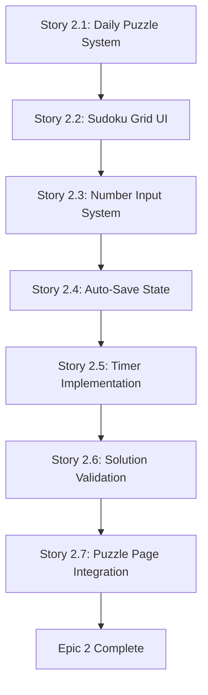

# Epic Technical Specification: Core Puzzle Experience

Date: 2025-11-16
Author: Spardutti
Epic ID: epic-2
Status: Draft

---

## Overview

Epic 2 delivers the fundamental daily Sudoku playing experience—the core product value. This epic transforms sudoku-race from an empty foundation into a playable puzzle game where users can solve a daily Sudoku challenge, validate their solutions, and see their completion times.

**Key Deliverables:**
- Daily puzzle generation and delivery system serving one medium-difficulty puzzle globally per day
- Interactive 9x9 Sudoku grid UI optimized for mobile touch and desktop keyboard input
- Touch-optimized number input system with responsive number pad (mobile) and keyboard shortcuts (desktop)
- Auto-save puzzle state management with localStorage (guest) and database persistence (authenticated users)
- Fair timing system with client display and server-side validation for competitive integrity
- Server-side solution validation with unlimited attempts and encouraging UX
- Polished puzzle page integration with newspaper aesthetic and WCAG AA accessibility

**Business Value:** This epic delivers the minimum viable product's core value proposition: "I can play a daily Sudoku puzzle." Without this, there is no product. Completing Epic 2 enables user testing, validates the pure challenge approach (no hints), and establishes the competitive integrity foundation (server-side validation, fair timing).

**Technical Scope:** This epic focuses on the complete user journey from loading today's puzzle → solving → submitting → seeing completion time. It includes both guest (localStorage) and authenticated user (database) flows, preparing for Epic 3's auth migration. No leaderboard ranking, streaks, or social features—those come in later epics.

## Objectives and Scope

### Primary Objectives

1. **Daily Puzzle System**: Implement puzzle generation, storage, and delivery ensuring all users globally receive the same medium-difficulty puzzle each day (UTC-based rotation)
2. **Interactive Solving Experience**: Create intuitive, responsive Sudoku grid with multi-platform input (touch, keyboard) and real-time cell updates
3. **State Persistence**: Auto-save puzzle progress for seamless resume experience (localStorage for guests, database for authenticated users)
4. **Fair Competitive Timing**: Implement timer with pause detection and server-side time validation to prevent manipulation
5. **Pure Challenge Validation**: Server-side solution checking with encouraging UX, unlimited attempts, and no hints during solving
6. **Polished Integration**: Cohesive puzzle page with newspaper aesthetic, accessibility compliance, and fast mobile performance

### Scope Boundaries

**In Scope:**
- Daily puzzle generation/rotation (Story 2.1)
- 9x9 grid UI with cell selection and visual feedback (Story 2.2)
- Number input via touch pad (mobile) and keyboard (desktop) (Story 2.3)
- Automatic state saving (debounced, localStorage + DB) (Story 2.4)
- Timer with auto-start, pause detection, server validation (Story 2.5)
- Solution validation with success/error flows (Story 2.6)
- Complete puzzle page with loading states, accessibility (Story 2.7)

**Out of Scope (Deferred to Later Epics):**
- OAuth authentication flows (Epic 3 - Epic 2 uses guest localStorage only)
- Leaderboard ranking and display (Epic 4 - validation saves completion but doesn't compute rank yet)
- Real-time leaderboard updates (Epic 4)
- Emoji grid generation and social sharing (Epic 5)
- Streak tracking and statistics dashboard (Epic 6)
- Profile management and account settings (Epic 3)

### Success Criteria

- ✅ Daily puzzle loads and displays correctly at midnight UTC
- ✅ Grid accepts input on both mobile (touch) and desktop (keyboard)
- ✅ Puzzle state persists across page refresh (guest can resume)
- ✅ Timer starts automatically, pauses on tab blur, displays accurate elapsed time
- ✅ Incorrect solutions show encouraging message ("Not quite right. Keep trying!")
- ✅ Correct solutions trigger completion flow with time display
- ✅ Authenticated users' completions saved to database for leaderboard (Epic 4)
- ✅ Page loads in <2 seconds on 3G, Lighthouse performance score >90

## System Architecture Alignment

Epic 2 implements the "Core Puzzle Experience Layer" of the architecture defined in `/docs/architecture.md`:

### Frontend Layer (Puzzle Components)

**Alignment:** Implements "Interactive Puzzle UI" architecture (docs/architecture.md Section 2.1)

- **Component Structure**: `/components/puzzle/` folder with specialized components
  - `SudokuGrid.tsx` - 9x9 grid with cell selection state
  - `NumberPad.tsx` - Touch-optimized 1-9 + Clear buttons
  - `Timer.tsx` - Live elapsed time display
  - `SubmitButton.tsx` - Validation trigger with disabled state
- **State Management**: Zustand store for local puzzle state (grid, selected cell, solve path)
- **Type Safety**: Full TypeScript coverage with strict mode enforcement
- **Styling**: Tailwind CSS with newspaper aesthetic (black grid lines, white cells, clean)

### Data Layer (Puzzle & Completion Tables)

**Alignment:** Extends "Relational Data Model" from Epic 1 (docs/architecture.md Section 2.2)

- **Puzzle Storage**: `puzzles` table (created in Epic 1) now populated with daily puzzles
- **Completion Tracking**: `completions` table stores in-progress and finished puzzle states
- **Server-Side Validation**: Solution validation happens exclusively on server to prevent cheating
- **Time Validation**: Server calculates `completion_time_seconds` from `started_at` - `completed_at` timestamps

### Server Action Layer (Puzzle API)

**Alignment:** Implements "Server Actions Pattern" (docs/architecture.md Section 4.2)

- **Actions Module**: `/actions/puzzle.ts` with type-safe server actions
  - `getPuzzleToday()` - Fetch today's puzzle (UTC-based)
  - `validatePuzzle()` - Check solution correctness (server-side)
  - `completePuzzle()` - Save completion and calculate time
- **Result Pattern**: All actions return `Result<T, E>` for consistent error handling
- **Auth-Aware**: Actions handle both guest (session-based) and authenticated users

### State Management (Zustand + localStorage)

**Alignment:** Implements "Hybrid State Architecture" (docs/architecture.md Section 4.3)

- **Zustand Store**: Client-side puzzle state management
  - Grid state (9x9 array, user entries)
  - Selected cell coordinates
  - Solve path tracking (for Epic 5 emoji grid)
- **Persistence**: Zustand `persist` middleware auto-saves to localStorage
- **Debouncing**: Auto-save debounced to 300ms to prevent excessive writes
- **Migration**: Guest localStorage data prepared for Epic 3 auth migration

### Timer Architecture (Client Display + Server Validation)

**Alignment:** Implements "Anti-Cheat Timer Pattern" (docs/architecture.md Section 4.3.4)

- **Client Timer**: `useTimer` hook displays elapsed time, pauses on tab blur
- **Server Timing**: `started_at` and `completed_at` server timestamps are source of truth
- **Fair Competition**: Client cannot manipulate server time, ensuring leaderboard integrity
- **Pause Detection**: Tab visibility API tracks focus loss (future: excessive pauses flagged)

### Performance Optimization

**Alignment:** Meets "Performance Targets" (docs/architecture.md Section 5.1)

- **Code Splitting**: Dynamic imports for heavy components (SudokuGrid)
- **Server Components**: Puzzle page uses Next.js RSC for initial data fetch
- **Optimistic UI**: Cell updates render immediately (no network delay)
- **Debounced Saves**: Auto-save throttled to prevent performance degradation
- **Target Metrics**: LCP <2.5s, FID <100ms, 60fps grid interactions

## Detailed Design

### Services and Modules

#### 2.1 Daily Puzzle Service Module

**File:** `/scripts/seed-puzzle.ts`

**Responsibility:** Generate or curate daily Sudoku puzzles and store in database.

**Inputs:**
- Difficulty level: 'medium' (hardcoded for MVP)
- Puzzle date: UTC date (YYYY-MM-DD format)

**Outputs:**
- Puzzle record inserted into `puzzles` table
- Returns puzzle ID and metadata

**Algorithm:**
```typescript
import { Sudoku } from 'sudoku-core'

export async function generateDailyPuzzle(date: string) {
  // 1. Generate puzzle with sudoku-core
  const puzzle = Sudoku.generate('medium')

  // 2. Extract puzzle data and solution
  const puzzleData = puzzle.puzzle // 9x9 array with 0s for empty
  const solution = puzzle.solution   // Complete 9x9 solution

  // 3. Insert into database
  const { data, error } = await supabase
    .from('puzzles')
    .insert({
      puzzle_date: date,
      puzzle_data: puzzleData,
      solution: solution,
      difficulty: 'medium'
    })
    .select()
    .single()

  if (error) throw new Error('Failed to seed puzzle')
  return data
}
```

**Deployment:**
- Manual execution: `npm run seed:puzzle` (MVP)
- Future: Vercel cron job at 00:00 UTC (post-MVP)

---

#### 2.2 Puzzle Retrieval Service

**File:** `/actions/puzzle.ts` - `getPuzzleToday()`

**Responsibility:** Fetch today's puzzle for the user.

**Server Action:**
```typescript
'use server'

export async function getPuzzleToday(): Promise<Puzzle> {
  const todayUTC = new Date().toISOString().split('T')[0] // YYYY-MM-DD

  const { data, error } = await supabase
    .from('puzzles')
    .select('id, puzzle_date, puzzle_data, difficulty')
    .eq('puzzle_date', todayUTC)
    .single()

  if (error || !data) {
    throw new Error('No puzzle available for today')
  }

  // CRITICAL: Never return solution field to client
  return {
    id: data.id,
    puzzle_date: data.puzzle_date,
    puzzle_data: data.puzzle_data,
    difficulty: data.difficulty
  }
}
```

**Security:** Solution field NEVER included in response—used only for server-side validation.

---

#### 2.3 SudokuGrid Component

**File:** `/components/puzzle/SudokuGrid.tsx`

**Responsibility:** Render 9x9 interactive Sudoku grid with cell selection and visual feedback.

**Props:**
```typescript
interface SudokuGridProps {
  puzzle: number[][] // Initial puzzle (0 = empty, 1-9 = clue)
  userEntries: number[][] // User-filled numbers
  selectedCell: { row: number; col: number } | null
  onCellSelect: (row: number, col: number) => void
  onNumberChange: (row: number, col: number, value: number) => void
}
```

**Component Structure:**
- CSS Grid layout (9 columns, 9 rows)
- Each cell is a `<button>` with `role="gridcell"`
- Clue cells: gray text, read-only (no click handler)
- Empty cells: white background, selectable
- User entries: black text, editable
- Selected cell: distinct border/background highlight

**Accessibility:**
- ARIA labels: "Row {row}, Column {col}, {empty|value}"
- Keyboard navigation: Arrow keys move selection
- Focus management: Selected cell receives focus
- Semantic HTML: `<div role="grid">` with `<button role="gridcell">`

**Performance:**
- Memoized with `React.memo` to prevent unnecessary re-renders
- Grid state lifted to Zustand (component is controlled)
- Tap targets: 44x44px minimum (mobile)

---

#### 2.4 NumberPad Component

**File:** `/components/puzzle/NumberPad.tsx`

**Responsibility:** Provide touch-optimized number input for mobile devices.

**Props:**
```typescript
interface NumberPadProps {
  onNumberSelect: (number: number) => void
  onClear: () => void
  disabled: boolean // True if no cell selected
}
```

**UI:**
- 10 buttons: 1-9 + "Clear"
- Grid layout: 3 columns, 4 rows (1-3, 4-6, 7-9, Clear)
- Large tap targets: 60x60px buttons
- Fixed position on mobile (sticky bottom)
- Hidden on desktop (keyboard input preferred)

**Behavior:**
- Tapping number calls `onNumberSelect(number)`
- "Clear" button calls `onClear()`
- Disabled state: buttons grayed out, not clickable

---

#### 2.5 Keyboard Input Handler

**File:** `/hooks/useKeyboardInput.ts`

**Responsibility:** Handle desktop keyboard input (number keys, arrow keys, backspace).

**Hook:**
```typescript
export function useKeyboardInput(
  selectedCell: { row: number; col: number } | null,
  onNumberChange: (row: number, col: number, value: number) => void,
  onCellSelect: (row: number, col: number) => void,
  onClear: () => void
) {
  useEffect(() => {
    function handleKeyDown(e: KeyboardEvent) {
      if (!selectedCell) return

      // Number keys: 1-9
      if (e.key >= '1' && e.key <= '9') {
        e.preventDefault()
        onNumberChange(selectedCell.row, selectedCell.col, parseInt(e.key))
      }

      // Clear: 0, Backspace, Delete
      if (e.key === '0' || e.key === 'Backspace' || e.key === 'Delete') {
        e.preventDefault()
        onClear()
      }

      // Arrow keys: navigate grid
      if (['ArrowUp', 'ArrowDown', 'ArrowLeft', 'ArrowRight'].includes(e.key)) {
        e.preventDefault()
        const newRow = /* calculate based on arrow key */
        const newCol = /* calculate based on arrow key */
        onCellSelect(newRow, newCol)
      }
    }

    document.addEventListener('keydown', handleKeyDown)
    return () => document.removeEventListener('keydown', handleKeyDown)
  }, [selectedCell, onNumberChange, onCellSelect, onClear])
}
```

---

#### 2.6 Puzzle State Store (Zustand)

**File:** `/lib/stores/puzzle-store.ts`

**Responsibility:** Manage client-side puzzle state with localStorage persistence.

**Store:**
```typescript
import { create } from 'zustand'
import { persist } from 'zustand/middleware'

interface PuzzleState {
  puzzleId: string | null
  grid: number[][] // User entries (0 = empty)
  selectedCell: { row: number; col: number } | null
  solvePath: SolvePathEntry[]
  elapsedSeconds: number

  // Actions
  setGrid: (grid: number[][]) => void
  updateCell: (row: number, col: number, value: number) => void
  selectCell: (row: number, col: number) => void
  clearCell: (row: number, col: number) => void
  resetPuzzle: () => void
}

export const usePuzzleStore = create<PuzzleState>()(
  persist(
    (set) => ({
      puzzleId: null,
      grid: Array(9).fill(0).map(() => Array(9).fill(0)),
      selectedCell: null,
      solvePath: [],
      elapsedSeconds: 0,

      setGrid: (grid) => set({ grid }),
      updateCell: (row, col, value) => set((state) => {
        const newGrid = state.grid.map(r => [...r])
        newGrid[row][col] = value

        // Track solve path (for Epic 5 emoji grid)
        const isCorrection = state.solvePath.some(
          e => e.row === row && e.col === col
        )
        const newPath = [
          ...state.solvePath,
          { row, col, value, timestamp: Date.now(), isCorrection }
        ]

        return { grid: newGrid, solvePath: newPath }
      }),
      selectCell: (row, col) => set({ selectedCell: { row, col } }),
      clearCell: (row, col) => set((state) => {
        const newGrid = state.grid.map(r => [...r])
        newGrid[row][col] = 0
        return { grid: newGrid }
      }),
      resetPuzzle: () => set({
        grid: Array(9).fill(0).map(() => Array(9).fill(0)),
        selectedCell: null,
        solvePath: [],
        elapsedSeconds: 0
      })
    }),
    {
      name: 'sudoku-puzzle-storage',
      partialize: (state) => ({
        puzzleId: state.puzzleId,
        grid: state.grid,
        solvePath: state.solvePath,
        elapsedSeconds: state.elapsedSeconds
      })
    }
  )
)
```

**Auto-Save Strategy:**
- Zustand `persist` middleware auto-saves to localStorage on state changes
- Debouncing handled at component level (update batched within 300ms)
- Storage key: `sudoku-puzzle-storage`
- Persisted fields: `puzzleId`, `grid`, `solvePath`, `elapsedSeconds`

---

#### 2.7 Timer Module

**File:** `/hooks/useTimer.ts`

**Responsibility:** Track elapsed puzzle time with pause detection.

**Hook:**
```typescript
export function useTimer(startTime: number, isActive: boolean) {
  const [elapsed, setElapsed] = useState(0)
  const [isPaused, setIsPaused] = useState(false)

  // Pause detection: tab visibility
  useEffect(() => {
    function handleVisibilityChange() {
      setIsPaused(document.hidden)
    }

    document.addEventListener('visibilitychange', handleVisibilityChange)
    return () => document.removeEventListener('visibilitychange', handleVisibilityChange)
  }, [])

  // Timer tick
  useEffect(() => {
    if (!isActive || isPaused) return

    const interval = setInterval(() => {
      setElapsed(Math.floor((Date.now() - startTime) / 1000))
    }, 1000)

    return () => clearInterval(interval)
  }, [startTime, isActive, isPaused])

  return { elapsed, isPaused }
}
```

**Display:**
```typescript
// Format: MM:SS (e.g., "12:34")
export function formatTime(seconds: number): string {
  const mins = Math.floor(seconds / 60)
  const secs = seconds % 60
  return `${mins}:${secs.toString().padStart(2, '0')}`
}
```

---

#### 2.8 Solution Validation Service

**File:** `/actions/puzzle.ts` - `validatePuzzle()`

**Responsibility:** Server-side solution validation with anti-cheat measures.

**Server Action:**
```typescript
'use server'

export async function validatePuzzle(
  puzzleId: string,
  solution: number[][]
): Promise<Result<{ correct: boolean }>> {
  try {
    // 1. Fetch correct solution from database
    const { data: puzzle, error } = await supabase
      .from('puzzles')
      .select('solution')
      .eq('id', puzzleId)
      .single()

    if (error || !puzzle) {
      return { success: false, error: 'Puzzle not found' }
    }

    // 2. Validate solution
    const correct = JSON.stringify(solution) === JSON.stringify(puzzle.solution)

    return { success: true, data: { correct } }
  } catch (error) {
    return { success: false, error: 'Validation failed' }
  }
}
```

**Validation Rules:**
- No client-side validation during solving (pure challenge approach)
- Server compares user solution against stored `solution` field
- Returns only boolean result (doesn't reveal correct answer)
- Unlimited attempts allowed (no "lives" system)

---

#### 2.9 Completion Service

**File:** `/actions/puzzle.ts` - `completePuzzle()`

**Responsibility:** Save completion record with server-calculated time.

**Server Action:**
```typescript
'use server'

export async function completePuzzle(
  puzzleId: string,
  solution: number[][],
  solvePath: SolvePathEntry[]
): Promise<Result<CompletionData>> {
  try {
    // 1. Validate auth (guest or authenticated)
    const supabase = await createServerClient()
    const { data: { user } } = await supabase.auth.getUser()

    // 2. Validate solution first
    const validation = await validatePuzzle(puzzleId, solution)
    if (!validation.success || !validation.data.correct) {
      return { success: false, error: 'Incorrect solution' }
    }

    // 3. Find existing completion record (started_at timestamp)
    const { data: existing } = await supabase
      .from('completions')
      .select('started_at')
      .eq('puzzle_id', puzzleId)
      .eq('user_id', user?.id || null)
      .single()

    const startedAt = existing?.started_at || new Date()
    const completedAt = new Date()
    const completionTime = Math.floor(
      (completedAt.getTime() - new Date(startedAt).getTime()) / 1000
    )

    // 4. Anti-cheat: Flag suspiciously fast times
    const flagged = completionTime < 120 // <2 minutes

    // 5. Upsert completion record
    const { data, error } = await supabase
      .from('completions')
      .upsert({
        user_id: user?.id || null,
        puzzle_id: puzzleId,
        completion_time_seconds: completionTime,
        completed_at: completedAt,
        solve_path: solvePath,
        flagged_for_review: flagged
      })
      .select()
      .single()

    if (error) {
      return { success: false, error: 'Failed to save completion' }
    }

    // 6. Insert leaderboard entry (for Epic 4)
    // Note: Rank calculation deferred to Epic 4
    await supabase.from('leaderboards').insert({
      puzzle_id: puzzleId,
      user_id: user?.id,
      completion_time_seconds: completionTime,
      rank: 0 // Placeholder, will be calculated in Epic 4
    })

    return {
      success: true,
      data: {
        completionTime,
        flagged
      }
    }
  } catch (error) {
    return { success: false, error: 'Completion failed' }
  }
}
```

**Server-Side Timing:**
- `started_at`: Set when user first loads puzzle (or existing record)
- `completed_at`: Set on successful completion
- `completion_time_seconds`: Server calculates difference (source of truth)
- Client timer is display-only, cannot affect leaderboard

---

### Data Models and Contracts

#### Puzzle Grid Representation

```typescript
// 9x9 array: 0 = empty cell, 1-9 = filled number
export type PuzzleGrid = number[][]

// Example puzzle (partial):
const puzzle: PuzzleGrid = [
  [5, 3, 0, 0, 7, 0, 0, 0, 0],
  [6, 0, 0, 1, 9, 5, 0, 0, 0],
  [0, 9, 8, 0, 0, 0, 0, 6, 0],
  // ... 6 more rows
]
```

#### Solve Path Entry (for Epic 5 emoji grid)

```typescript
export type SolvePathEntry = {
  row: number        // 0-8
  col: number        // 0-8
  value: number      // 1-9
  timestamp: number  // Date.now()
  isCorrection: boolean // True if cell was already filled
}

// Example solve path
const solvePath: SolvePathEntry[] = [
  { row: 0, col: 2, value: 4, timestamp: 1699999999, isCorrection: false },
  { row: 1, col: 1, value: 7, timestamp: 1700000002, isCorrection: false },
  { row: 0, col: 2, value: 6, timestamp: 1700000005, isCorrection: true }, // Changed mind
]
```

#### Puzzle Type

```typescript
export type Puzzle = {
  id: string
  puzzle_date: string // YYYY-MM-DD (UTC)
  puzzle_data: PuzzleGrid
  difficulty: 'easy' | 'medium' | 'hard' // MVP: always 'medium'
}
```

#### Completion Data

```typescript
export type CompletionData = {
  completionTime: number // seconds
  flagged: boolean       // true if <120 seconds
}
```

#### Database Schema Updates

Epic 2 uses existing tables from Epic 1 but now populates them:

**`puzzles` table:**
- Populated by `/scripts/seed-puzzle.ts`
- One record per day (unique constraint on `puzzle_date`)
- `solution` field never exposed to client

**`completions` table:**
- `started_at`: Set when puzzle loads (or on first interaction)
- `completed_at`: Set when correct solution submitted
- `completion_time_seconds`: Auto-calculated by server
- `solve_path`: JSONB array of `SolvePathEntry[]`
- `completion_data`: JSONB for in-progress grid state (auto-save)
- `is_guest`: Boolean (true for unauthenticated users)

**No schema changes needed** - Epic 1 created all required tables.

---

### APIs and Interfaces

#### Server Actions API

**Module:** `/actions/puzzle.ts`

**1. Get Today's Puzzle**
```typescript
export async function getPuzzleToday(): Promise<Puzzle>
```
- Returns: Today's puzzle (UTC date)
- Errors: Throws if no puzzle found
- Usage: Called on puzzle page load (Server Component)

**2. Validate Solution**
```typescript
export async function validatePuzzle(
  puzzleId: string,
  solution: number[][]
): Promise<Result<{ correct: boolean }>>
```
- Returns: `{ correct: true/false }`
- Errors: `Result` with error message
- Usage: Called on "Submit" button click

**3. Complete Puzzle**
```typescript
export async function completePuzzle(
  puzzleId: string,
  solution: number[][],
  solvePath: SolvePathEntry[]
): Promise<Result<CompletionData>>
```
- Returns: `{ completionTime, flagged }`
- Errors: `Result` with error message
- Side Effects: Inserts `completions` and `leaderboards` records
- Usage: Called after successful validation

---

#### Component Props Interfaces

**SudokuGrid:**
```typescript
interface SudokuGridProps {
  puzzle: number[][]
  userEntries: number[][]
  selectedCell: { row: number; col: number } | null
  onCellSelect: (row: number, col: number) => void
  onNumberChange: (row: number, col: number, value: number) => void
}
```

**NumberPad:**
```typescript
interface NumberPadProps {
  onNumberSelect: (number: number) => void
  onClear: () => void
  disabled: boolean
}
```

**Timer:**
```typescript
interface TimerProps {
  startTime: number
  isActive: boolean
}
```

**SubmitButton:**
```typescript
interface SubmitButtonProps {
  disabled: boolean
  onSubmit: () => void
  isLoading: boolean
}
```

---

### Workflows and Sequencing

#### Epic 2 Story Execution Sequence



**Story 2.1: Daily Puzzle System & Data Management** (No dependencies on other Epic 2 stories)
- Create `/scripts/seed-puzzle.ts` script
- Implement `getPuzzleToday()` server action
- Test puzzle generation and retrieval
- Seed 7 puzzles for testing

**Story 2.2: Sudoku Grid UI Component** (Depends on 2.1)
- **Prerequisite:** Puzzle data structure from 2.1
- Create `<SudokuGrid>` component
- Implement cell selection logic
- Apply newspaper aesthetic styling
- Test on mobile (320px) and desktop (1024px+)

**Story 2.3: Number Input System** (Depends on 2.2)
- **Prerequisite:** Grid component with `onNumberChange` callback
- Create `<NumberPad>` component (mobile)
- Implement `useKeyboardInput` hook (desktop)
- Test multi-platform input (touch + keyboard)

**Story 2.4: Puzzle State Auto-Save** (Depends on 2.2, 2.3)
- **Prerequisites:**
  - Grid state from 2.2
  - Input events from 2.3
- Create Zustand store with `persist` middleware
- Implement auto-save debouncing (300ms)
- Test localStorage persistence across page refresh

**Story 2.5: Timer Implementation** (Depends on 2.4)
- **Prerequisite:** Puzzle loading workflow from 2.1, 2.4
- Create `useTimer` hook
- Implement pause detection (tab visibility)
- Create `<Timer>` display component
- Test timer accuracy and pause behavior

**Story 2.6: Solution Validation & Completion Flow** (Depends on 2.1, 2.5)
- **Prerequisites:**
  - Puzzle solution data from 2.1
  - Timer data for completion time from 2.5
- Implement `validatePuzzle()` server action
- Implement `completePuzzle()` server action
- Create `<SubmitButton>` component
- Create completion modal/message
- Test validation (correct/incorrect paths)

**Story 2.7: Puzzle Page Integration & UX Polish** (Depends on ALL previous Epic 2 stories)
- **Prerequisites:** All components from 2.2-2.6
- Create `/app/puzzle/page.tsx`
- Integrate all components into cohesive page
- Add loading states and error handling
- Add accessibility features (ARIA, keyboard nav)
- Polish newspaper aesthetic
- Performance optimization (code splitting, lazy loading)

---

#### User Flow: Guest User Plays Daily Puzzle

```
1. User navigates to /puzzle
   ↓
2. Server Component fetches today's puzzle (getPuzzleToday)
   ↓
3. Puzzle page renders with:
   - SudokuGrid (puzzle data)
   - NumberPad (mobile) or keyboard listener (desktop)
   - Timer (auto-starts)
   - SubmitButton (disabled until grid complete)
   ↓
4. User selects cell → SudokuGrid updates selectedCell state
   ↓
5. User enters number → onNumberChange updates grid + Zustand store
   ↓
6. Zustand persist middleware auto-saves to localStorage (debounced 300ms)
   ↓
7. User fills all cells → SubmitButton enabled
   ↓
8. User clicks Submit → validatePuzzle() server action called
   ↓
9. If incorrect:
   - Show "Not quite right. Keep trying!" message
   - Timer continues
   - User can modify and re-submit
   ↓
10. If correct:
   - Timer stops
   - completePuzzle() server action called
   - Completion data saved to database (for Epic 4 leaderboard)
   - Show "Solved in {time}!" success message
   - (Epic 3: Show auth prompt for guests)
```

---

#### Parallel Execution Opportunities

**Story 2.2 + 2.3 (Grid + Input):**
- Component development can be parallelized
- Grid component works independently with mock input
- Input components can be built with mock grid

**Story 2.5 + 2.6 (Timer + Validation):**
- Timer UI can be built independently
- Validation logic can be implemented in parallel
- Integration happens in Story 2.7

**Within Story 2.7:**
- Loading states, error handling, accessibility can be implemented in parallel
- Different team members can tackle different UX concerns simultaneously

---

## Non-Functional Requirements

### Performance

Epic 2 implements a performance-critical interactive UI that must feel instant and responsive.

**Load Time Targets:**
- **Puzzle Page Load (First Paint)**: <1.5s on 3G connection
- **Time to Interactive**: <2.5s (user can start solving)
- **Grid Render Time**: <100ms (initial 81 cells)
- **Cell Update Latency**: <16ms (60fps interaction)
- **Auto-Save Debounce**: 300ms (balance between UX and performance)

**Performance Strategies:**

**1. Server Components for Initial Data**
```typescript
// app/puzzle/page.tsx (Server Component)
export default async function PuzzlePage() {
  const puzzle = await getPuzzleToday() // Server-side fetch
  return <PuzzleClient puzzle={puzzle} /> // Hydrate with data
}
```
- Fetch puzzle on server (Next.js RSC)
- Send pre-rendered HTML to client
- Avoid client-side loading spinner

**2. Code Splitting**
```typescript
// Lazy load heavy components
const SudokuGrid = dynamic(() => import('@/components/puzzle/SudokuGrid'), {
  loading: () => <GridSkeleton />,
  ssr: false // Client-only component
})
```

**3. Memoization**
```typescript
// Prevent unnecessary re-renders
export const SudokuGrid = React.memo(function SudokuGrid({ puzzle, ... }) {
  // Component logic
})
```

**4. Debounced Auto-Save**
```typescript
import { debounce } from 'lodash'

const debouncedSave = debounce((state) => {
  localStorage.setItem('puzzle-storage', JSON.stringify(state))
}, 300) // 300ms delay
```

**5. Optimistic UI Updates**
- Grid updates render immediately (no network roundtrip)
- Validation happens only on submit (not per-cell)
- Timer updates in-memory (no database writes until completion)

**Bundle Size Targets:**
- Puzzle page bundle: <80KB gzipped
- SudokuGrid component: <20KB gzipped
- Total JavaScript (including framework): <180KB gzipped

**Performance Monitoring:**
- Lighthouse performance score: >90 (mobile)
- Core Web Vitals:
  - LCP (Largest Contentful Paint): <2.5s
  - FID (First Input Delay): <100ms
  - CLS (Cumulative Layout Shift): <0.1

---

### Security

Epic 2 implements critical anti-cheat and competitive integrity measures.

**Server-Side Solution Validation:**
- ✅ **NEVER** send solution to client
- ✅ All validation happens on server (prevent client manipulation)
- ✅ Solution stored in database, never in localStorage or browser

**Server-Side Time Validation:**
- ✅ `started_at` timestamp set on server (when puzzle loads or first interaction)
- ✅ `completed_at` timestamp set on server (when correct solution validated)
- ✅ `completion_time_seconds` calculated on server (source of truth)
- ✅ Client timer is display-only, cannot manipulate leaderboard time

**Anti-Cheat Measures:**
```typescript
// Flag suspiciously fast times
const completionTime = Math.floor((completedAt - startedAt) / 1000)
const flagged = completionTime < 120 // <2 minutes flagged for review

// Future: Track pause events
const pauseEvents = [
  { timestamp: 1700000000, duration: 30 }, // User paused for 30s
  // ... excessive pauses may indicate cheating
]
```

**Rate Limiting:**
```typescript
// Prevent brute-force solution attempts
const limiter = rateLimit({
  interval: 60 * 1000, // 1 minute
  uniqueTokenPerInterval: 500
})

await limiter.check(100, userId) // Max 100 submissions per minute
```

**Input Validation:**
```typescript
// Validate grid before accepting
function isValidGrid(grid: number[][]): boolean {
  // Check structure: 9x9 array
  if (grid.length !== 9) return false
  if (!grid.every(row => row.length === 9)) return false

  // Check values: 0-9 only
  const validNumbers = grid.flat().every(n => n >= 0 && n <= 9)
  return validNumbers
}
```

**localStorage Security:**
- No sensitive data in localStorage (only puzzle state)
- Puzzle state can be cleared without consequence (user can replay)
- Solution never stored client-side

---

### Reliability/Availability

**Error Handling Strategies:**

**1. Graceful Degradation**
```typescript
// If puzzle fetch fails, show friendly error
async function PuzzlePage() {
  try {
    const puzzle = await getPuzzleToday()
    return <PuzzleClient puzzle={puzzle} />
  } catch (error) {
    return (
      <div className="error-state">
        <p>Today's puzzle is being prepared. Check back in a moment!</p>
        <button onClick={() => window.location.reload()}>Retry</button>
      </div>
    )
  }
}
```

**2. Auto-Save Resilience**
```typescript
// Retry failed saves with exponential backoff
async function saveWithRetry(data, retries = 3) {
  for (let i = 0; i < retries; i++) {
    try {
      await saveToLocalStorage(data)
      return
    } catch (error) {
      if (i === retries - 1) throw error
      await delay(2 ** i * 1000) // 1s, 2s, 4s
    }
  }
}
```

**3. Timer Recovery**
```typescript
// Resume timer from saved state on page refresh
const savedElapsed = localStorage.getItem('puzzle-elapsed')
const startTime = Date.now() - (savedElapsed || 0) * 1000
```

**4. Validation Retry**
```typescript
// Show retry button on validation failure
{validationError && (
  <div className="error-message">
    <p>Validation failed. Please try again.</p>
    <button onClick={retryValidation}>Retry</button>
  </div>
)}
```

**Puzzle Availability:**
- **Daily Puzzle Seeding**: Manual execution for MVP (acceptable risk)
- **Fallback**: Developer manually seeds puzzle if script fails
- **Monitoring**: Alert if no puzzle exists for today's date
- **Future**: Automated Vercel cron job with retry logic

**Data Persistence:**
- **Guest users**: localStorage auto-save every 300ms (debounced)
- **Authenticated users**: Database upsert on completion
- **Backup**: Guest localStorage data preserved even if database fails
- **Migration**: Epic 3 will migrate localStorage → database on auth

---

### Observability

**Logging Strategy:**

**1. Puzzle Load Events**
```typescript
logger.info('Puzzle loaded', {
  puzzleId: puzzle.id,
  puzzleDate: puzzle.puzzle_date,
  userId: user?.id || 'guest'
})
```

**2. Validation Attempts**
```typescript
logger.info('Solution validated', {
  puzzleId,
  userId,
  correct: validation.data.correct,
  attempts: attemptCount
})
```

**3. Completion Events**
```typescript
logger.info('Puzzle completed', {
  puzzleId,
  userId,
  completionTime: data.completionTime,
  flagged: data.flagged
})
```

**4. Error Tracking**
```typescript
logger.error('Puzzle fetch failed', error, {
  puzzleDate: todayUTC,
  errorCode: error.code
})
```

**Metrics to Track:**

**User Engagement:**
- Daily active users (DAU)
- Puzzle starts (users who load puzzle page)
- Puzzle completions (correct solutions)
- Completion rate (completions / starts)
- Average solve time (for difficulty calibration)

**Performance Metrics:**
- Puzzle page load time (LCP)
- Grid interaction latency (FID)
- Auto-save execution time
- Validation response time

**Quality Metrics:**
- Validation error rate (database failures)
- Auto-save failure rate
- Flagged completion rate (potential cheating)
- Timer pause event frequency

**Custom Events:**
```typescript
// Track user interactions
track('cell_selected', { row, col })
track('number_entered', { value })
track('puzzle_submitted', { attemptNumber })
track('puzzle_completed', { time, flagged })
```

---

## Dependencies and Integrations

### External Dependencies (NPM Packages)

**Puzzle Generation:**
```json
{
  "dependencies": {
    "sudoku-core": "^3.0.3"
  }
}
```
- **Purpose**: Generate valid Sudoku puzzles with configurable difficulty
- **Alternative**: Use pre-curated puzzle dataset (JSON file)
- **Risk**: Low (stable library, TypeScript-native)

**State Management:**
```json
{
  "dependencies": {
    "zustand": "^4.4.0"
  }
}
```
- **Purpose**: Lightweight client-side state management
- **Alternative**: React Context + useReducer
- **Risk**: Very low (minimal dependency, well-maintained)

**Utility:**
```json
{
  "dependencies": {
    "lodash": "^4.17.21"
  }
}
```
- **Purpose**: Debounce function for auto-save
- **Alternative**: Custom debounce implementation (reduce bundle size)
- **Risk**: Very low (standard utility library)

---

### Internal Dependencies (Epic 1 Outputs)

**From Epic 1.1 (Project Init):**
- ✅ Next.js 16 project structure
- ✅ TypeScript strict mode configuration
- ✅ Tailwind CSS for styling
- ✅ Vercel deployment pipeline

**From Epic 1.2 (Supabase Setup):**
- ✅ Supabase client (`/lib/supabase.ts`)
- ✅ Database tables: `puzzles`, `completions`, `leaderboards`
- ✅ TypeScript database types (`/types/database.ts`)

**From Epic 1.3 (Core Routing):**
- ✅ Root layout with Header/Footer
- ✅ Routing structure (can create `/puzzle` route)

**From Epic 1.4 (Testing):**
- ✅ Jest + React Testing Library setup
- ✅ CI/CD pipeline (GitHub Actions)
- ✅ Test coverage thresholds (70%)

**From Epic 1.5 (Design System):**
- ✅ Design tokens (colors, typography, spacing)
- ✅ Base UI components (Button, Card)
- ✅ Newspaper aesthetic theme

---

### Integration Points for Future Epics

**Epic 3 (Authentication):**
- **Integration**: Guest localStorage data migration
- **Dependency**: Epic 2 stores puzzle state in localStorage
- **Flow**: Epic 3 reads localStorage on auth, migrates to database
- **Preparation**: `usePuzzleStore` designed with migration in mind (serializable state)

**Epic 4 (Leaderboards):**
- **Integration**: Completion data used for leaderboard ranking
- **Dependency**: Epic 2 inserts `leaderboards` records with placeholder rank
- **Flow**: Epic 4 calculates actual rank and updates records
- **Preparation**: `completion_time_seconds` is source of truth for ranking

**Epic 5 (Social Sharing):**
- **Integration**: Solve path data used for emoji grid generation
- **Dependency**: Epic 2 tracks `solvePath` in Zustand store and database
- **Flow**: Epic 5 reads `solve_path` JSONB field, generates emoji grid
- **Preparation**: `SolvePathEntry` type designed with emoji generation in mind

**Epic 6 (Engagement & Retention):**
- **Integration**: Completion data used for streak tracking
- **Dependency**: Epic 2 saves completion timestamps
- **Flow**: Epic 6 queries `completions` table to calculate streaks
- **Preparation**: `completed_at` timestamp enables daily streak calculation

---

### No External API Integrations

Epic 2 does not integrate third-party APIs beyond infrastructure (Supabase, Vercel). All puzzle logic is self-contained.

**Future Integrations (Post-MVP):**
- **Puzzle API**: If switching from local generation to external service
- **Analytics**: Custom event tracking (Mixpanel, Amplitude)
- **Error Tracking**: Sentry (from Epic 1 monitoring stories)

---

## Acceptance Criteria (Authoritative)

### Story 2.1: Daily Puzzle System & Data Management

**AC-2.1.1: Puzzle Generation Script**
- ✅ `/scripts/seed-puzzle.ts` script created
- ✅ Script generates valid medium-difficulty Sudoku puzzle
- ✅ Script validates puzzle has unique solution
- ✅ Script inserts puzzle into `puzzles` table with today's UTC date
- ✅ Script can be run manually: `npm run seed:puzzle`

**AC-2.1.2: Puzzle Retrieval API**
- ✅ `getPuzzleToday()` server action created in `/actions/puzzle.ts`
- ✅ Action fetches puzzle where `puzzle_date = today (UTC)`
- ✅ Action returns: `id`, `puzzle_date`, `puzzle_data`, `difficulty`
- ✅ Action NEVER returns `solution` field (security)
- ✅ Action throws error if no puzzle found for today

**AC-2.1.3: Solution Validation API**
- ✅ `validatePuzzle()` server action created
- ✅ Action compares user solution against stored solution (server-side)
- ✅ Action returns: `{ correct: true/false }`
- ✅ Action does NOT reveal correct answer if wrong
- ✅ Action rate limited (max 100 attempts per hour per user)

**AC-2.1.4: Test Data**
- ✅ At least 7 puzzles pre-seeded in database for testing
- ✅ Puzzles span consecutive dates for multi-day testing

---

### Story 2.2: Sudoku Grid UI Component (Mobile-Optimized)

**AC-2.2.1: Grid Rendering**
- ✅ `<SudokuGrid>` component created in `/components/puzzle/`
- ✅ Renders 9x9 grid using CSS Grid layout
- ✅ Pre-filled clue numbers displayed in gray (read-only)
- ✅ Empty cells ready for user input
- ✅ Grid lines clearly delineate 3x3 subgrids (thicker borders)
- ✅ Responsive: grid scales to fit viewport on mobile (320px-767px)

**AC-2.2.2: Cell Selection**
- ✅ Tap/click a cell to select it
- ✅ Selected cell highlighted with distinct border/background
- ✅ Only one cell selected at a time
- ✅ Pre-filled clue cells cannot be selected (read-only)
- ✅ Visual feedback on tap (immediate response, <50ms latency)

**AC-2.2.3: Visual Distinction**
- ✅ User-entered numbers displayed in black (vs gray clues)
- ✅ User can easily distinguish their entries from clues
- ✅ Newspaper aesthetic applied (clean borders, high contrast)

**AC-2.2.4: Grid State Management**
- ✅ Component receives puzzle data as prop
- ✅ Component maintains local state for user-entered numbers (via Zustand)
- ✅ Component emits changes to parent (for auto-save in Story 2.4)

**AC-2.2.5: Accessibility**
- ✅ Keyboard navigation: arrow keys move selection
- ✅ Screen reader announces cell position ("Row 3, Column 5")
- ✅ Focus indicators visible for keyboard users
- ✅ ARIA labels on all grid cells
- ✅ Cell tap targets ≥44x44px (mobile)

**AC-2.2.6: Testing**
- ✅ Component unit tests written (React Testing Library)
- ✅ Tests verify rendering, selection, keyboard navigation
- ✅ No visual errors on mobile (320px width tested)
- ✅ Coverage ≥70%

---

### Story 2.3: Number Input System (Touch & Keyboard)

**AC-2.3.1: Mobile Number Pad**
- ✅ `<NumberPad>` component created with buttons 1-9 + Clear
- ✅ Buttons are large tap targets (minimum 44x44px)
- ✅ Tapping a number fills the selected cell immediately
- ✅ "Clear" button empties the selected cell
- ✅ Number pad is sticky/fixed position on mobile
- ✅ Number pad hidden on desktop (>768px width)

**AC-2.3.2: Desktop Keyboard Input**
- ✅ `useKeyboardInput` hook created for keyboard handling
- ✅ Number keys (1-9) input numbers directly into selected cell
- ✅ Backspace/Delete or "0" key clears selected cell
- ✅ Arrow keys navigate grid selection
- ✅ Keyboard shortcuts work without selecting input field

**AC-2.3.3: Input Validation**
- ✅ Only numbers 1-9 accepted (no other characters)
- ✅ Pre-filled clue cells cannot be modified (read-only)
- ✅ Invalid input ignored gracefully (no error messages)

**AC-2.3.4: Visual Feedback**
- ✅ Immediate visual response on input (number appears in cell)
- ✅ Selected cell remains highlighted after input
- ✅ User can immediately select another cell and continue

**AC-2.3.5: Cross-Platform Testing**
- ✅ Works on iOS Safari (mobile)
- ✅ Works on Android Chrome (mobile)
- ✅ Works on desktop browsers (Chrome, Safari, Firefox)
- ✅ Touch and keyboard inputs tested independently

---

### Story 2.4: Puzzle State Auto-Save & Session Management

**AC-2.4.1: Auto-Save Implementation**
- ✅ Zustand store created with `persist` middleware
- ✅ Progress auto-saves on every cell input (debounced 300ms)
- ✅ For guests: saved to browser localStorage
- ✅ For authenticated users: saved to Supabase `completions` table
- ✅ No visible "saving..." indicator (seamless background save)

**AC-2.4.2: State Restoration**
- ✅ On page refresh, grid state restored from localStorage (guest) or DB (auth)
- ✅ Timer state restored (elapsed time continues from saved value)
- ✅ User can resume exactly where they left off
- ✅ Restoration happens before grid renders (no flash of empty grid)

**AC-2.4.3: State Structure**
- ✅ State includes: user-entered numbers (9x9 grid)
- ✅ State includes: elapsed time (in seconds)
- ✅ State includes: completion status (in-progress, completed)
- ✅ State includes: puzzle ID (to ensure correct puzzle restored)

**AC-2.4.4: LocalStorage Schema (Guests)**
```typescript
{
  puzzleId: string
  grid: number[][] // 9x9 array
  solvePath: SolvePathEntry[]
  elapsedSeconds: number
}
```

**AC-2.4.5: Database Schema (Authenticated)**
- ✅ `completions` table updated with `is_complete: false` for in-progress
- ✅ `completion_data` JSONB field stores user grid state
- ✅ On completion, `is_complete: true` and `completion_time_seconds` recorded

**AC-2.4.6: Edge Cases**
- ✅ If user starts new puzzle (next day), old state cleared
- ✅ If localStorage corrupted, gracefully fail and start fresh
- ✅ Authenticated users can resume on different devices (state in DB)

---

### Story 2.5: Timer Implementation (Auto-Start, Fair Timing)

**AC-2.5.1: Timer Display**
- ✅ `<Timer>` component created
- ✅ Timer starts automatically when puzzle page loads
- ✅ Displays in MM:SS format (e.g., "12:34")
- ✅ Updates every second
- ✅ Shows in prominent location (top of grid or header)

**AC-2.5.2: Timer Behavior**
- ✅ Starts from 0:00 for new puzzle
- ✅ Resumes from saved elapsed time if returning to in-progress puzzle
- ✅ Continues running through submit attempts (even if answer wrong)
- ✅ Stops when puzzle is correctly completed

**AC-2.5.3: Fair Timing Rules**
- ✅ Timer pauses when browser tab loses focus (prevents gaming)
- ✅ Timer resumes when tab regains focus
- ✅ Pause/resume events logged (for anti-cheat analysis)
- ✅ Client timer is for display only (server validates actual time)

**AC-2.5.4: Server-Side Time Tracking**
- ✅ Server tracks puzzle start time (when user first loads puzzle)
- ✅ Server tracks completion time (when user submits correct solution)
- ✅ Server calculates actual elapsed time: `completed_at - started_at`
- ✅ Server time is source of truth for leaderboard (client time ignored)

**AC-2.5.5: Timer State Persistence**
- ✅ Elapsed time saved with puzzle state (Story 2.4)
- ✅ On page refresh, timer resumes from saved time
- ✅ Timer state persists in localStorage (guest) or database (auth)

**AC-2.5.6: Timer Styling**
- ✅ Newspaper aesthetic (serif font, clean, high contrast)
- ✅ Fixed position (doesn't scroll away)
- ✅ Readable on mobile (minimum 16px font size)

---

### Story 2.6: Solution Validation & Completion Flow

**AC-2.6.1: Solution Submission**
- ✅ "Submit" button created (`<SubmitButton>`)
- ✅ Button disabled until all cells filled
- ✅ Clicking button triggers validation
- ✅ Client sends complete grid to server API (`POST /api/puzzle/validate`)
- ✅ Server compares against stored correct solution
- ✅ Server returns `{correct: true/false}` response
- ✅ Validation happens server-side only (prevent client manipulation)

**AC-2.6.2: Incorrect Solution Flow**
- ✅ Encouraging message displays: "Not quite right. Keep trying!"
- ✅ Timer continues running (no penalty)
- ✅ User can modify grid and re-submit (unlimited attempts)
- ✅ No indication of which cells are wrong (pure challenge)

**AC-2.6.3: Correct Solution Flow**
- ✅ Timer stops
- ✅ Completion animation plays (simple, newspaper aesthetic)
- ✅ Completion time prominently displayed
- ✅ Completion data saved to database:
  - For auth users: `completions` table with `completion_time_seconds`, `completed_at`
  - For guest users: localStorage only (prompt to sign in)
- ✅ Success message: "Solved in {time}! 🎉"

**AC-2.6.4: Completion Flow Continuation**
- ✅ Completion modal/screen displays
- ✅ Shows: completion time, (leaderboard rank if auth - Epic 4)
- ✅ Gentle auth prompt for guests: "Sign in to claim your rank!"

**AC-2.6.5: Server Validation Rules**
- ✅ Check all cells filled (no empty cells)
- ✅ Validate rows (1-9 appear once in each row)
- ✅ Validate columns (1-9 appear once in each column)
- ✅ Validate 3x3 subgrids (1-9 appear once in each subgrid)
- ✅ Compare against stored solution for correctness

**AC-2.6.6: Anti-Cheat Measures**
- ✅ Completion time validated server-side (must be >60 seconds minimum)
- ✅ Suspiciously fast times (<2 minutes) flagged for review
- ✅ Rate limiting on submit endpoint (max 100 attempts per hour)

---

### Story 2.7: Puzzle Page Integration & UX Polish

**AC-2.7.1: Puzzle Page Structure**
- ✅ `/app/puzzle/page.tsx` created (or home `/` redirects to `/puzzle`)
- ✅ Page displays: "Today's Puzzle" header with date (e.g., "November 16, 2025")
- ✅ Puzzle number displayed (e.g., "Puzzle #42")
- ✅ Timer in prominent location
- ✅ Sudoku grid centered and responsive
- ✅ Number input system (mobile pad or keyboard instructions)
- ✅ "Submit" button (disabled until grid complete)
- ✅ Clean newspaper aesthetic throughout

**AC-2.7.2: Responsive Layout**
- ✅ Mobile-first responsive (320px-767px primary)
- ✅ Grid scales appropriately on all screen sizes
- ✅ No horizontal scroll on mobile
- ✅ Generous white space (not cramped)
- ✅ Fast load time (<2 seconds on 3G)

**AC-2.7.3: Loading States**
- ✅ Skeleton loader while puzzle fetches
- ✅ Graceful error if puzzle fails to load: "Today's puzzle is being prepared. Check back in a moment!"
- ✅ Retry button if network error

**AC-2.7.4: First-Time User Experience**
- ✅ Brief instructions visible on first visit: "Fill the grid so each row, column, and 3x3 box contains 1-9"
- ✅ Dismissible tip (don't show again after first visit)
- ✅ No hints or helpers (pure challenge approach)

**AC-2.7.5: Accessibility**
- ✅ Semantic HTML (proper heading hierarchy)
- ✅ ARIA labels for screen readers
- ✅ Keyboard navigation works smoothly
- ✅ Focus management (Submit button gets focus when grid complete)
- ✅ Color contrast meets WCAG AA (black on white, high contrast)

**AC-2.7.6: Performance Optimizations**
- ✅ Puzzle data fetched server-side (Next.js SSR or Server Component)
- ✅ Grid renders without layout shift
- ✅ Number input responds within 100ms of tap
- ✅ Smooth 60fps interactions
- ✅ Lighthouse performance score >90 (mobile)

**AC-2.7.7: Newspaper Aesthetic Polish**
- ✅ Serif typography for headers ("Today's Puzzle")
- ✅ Sans-serif for grid numbers (readability)
- ✅ Black & white base with spot color accent (#1a73e8)
- ✅ Clean grid lines (thicker for 3x3 subgrids)
- ✅ Minimal shadows for depth (optional, keep clean)

---

### Epic 2 Completion Criteria

Epic 2 is considered complete when:
- ✅ All 7 stories completed (all acceptance criteria met)
- ✅ Daily puzzle loads and displays correctly
- ✅ User can solve puzzle on both mobile and desktop
- ✅ Puzzle state auto-saves and restores on page refresh
- ✅ Timer displays accurately and pauses on tab blur
- ✅ Correct solutions trigger completion flow with time display
- ✅ Server-side validation prevents cheating
- ✅ Page loads in <2s on 3G, Lighthouse score >90
- ✅ All tests passing with ≥70% coverage
- ✅ Deployed to Vercel production and manually verified

---

## Traceability Mapping

### Epic 2 → PRD Functional Requirements

**Story 2.1 (Daily Puzzle System):**
- **FR-1.1** (Daily puzzle generation) → ✅ Implemented via seed script + `getPuzzleToday()`
- **FR-1.2** (Persistent puzzle state) → ✅ Foundation for state management (completed in 2.4)

**Story 2.2 (Sudoku Grid UI):**
- **FR-2.1** (Sudoku grid interface) → ✅ 9x9 responsive grid with cell selection

**Story 2.3 (Number Input):**
- **FR-2.2** (Number input system) → ✅ Touch pad (mobile) + keyboard (desktop)

**Story 2.4 (Auto-Save State):**
- **FR-1.2** (Persistent puzzle state) → ✅ Auto-save to localStorage/DB with debouncing

**Story 2.5 (Timer):**
- **FR-3.1** (Automatic timer) → ✅ Auto-start timer with pause detection
- **FR-3.2** (Completion time recording) → ✅ Server-side time validation

**Story 2.6 (Validation):**
- **FR-2.3** (Solution validation) → ✅ Server-side validation, unlimited attempts
- **FR-3.2** (Completion time recording) → ✅ Save completion with server-calculated time

**Story 2.7 (Page Integration):**
- **FR-2.1** (Grid interface) → ✅ Complete puzzle page with all components integrated
- **FR-9.1** (Mobile-first responsive) → ✅ Responsive layout, newspaper aesthetic
- **FR-9.2** (Accessibility) → ✅ WCAG AA compliance, keyboard navigation

---

### Epic 2 → Architecture Decisions

**Story 2.1 → Architecture Section 2.2 (Database):**
- ✅ Uses `puzzles` table from Epic 1
- ✅ Populates daily puzzle data via seed script
- ✅ Server actions pattern for data fetching

**Story 2.2-2.3 → Architecture Section 2.1 (Frontend):**
- ✅ Component-driven UI (SudokuGrid, NumberPad)
- ✅ TypeScript strict mode for type safety
- ✅ Tailwind CSS for newspaper aesthetic

**Story 2.4 → Architecture Section 4.3 (State Management):**
- ✅ Zustand for local state management
- ✅ `persist` middleware for localStorage
- ✅ Auto-save pattern with debouncing

**Story 2.5 → Architecture Section 4.3.4 (Timer Pattern):**
- ✅ Client display + server validation (anti-cheat)
- ✅ Pause detection via Visibility API
- ✅ Server timestamps as source of truth

**Story 2.6 → Architecture Section 4.2 (Server Actions):**
- ✅ Server-side validation prevents cheating
- ✅ Result<T, E> pattern for error handling
- ✅ Rate limiting for abuse prevention

**Story 2.7 → Architecture Section 5.1 (Performance):**
- ✅ Server Components for initial data fetch
- ✅ Code splitting for heavy components
- ✅ Optimistic UI updates
- ✅ Performance targets met (LCP <2.5s, FID <100ms)

---

### Epic 2 → Epic 1 Dependencies

**Epic 1.1 (Project Init):**
- ✅ Next.js 16 + React 19 project structure → Used for all Epic 2 components
- ✅ TypeScript strict mode → Applied to all Epic 2 code
- ✅ Tailwind CSS → Used for all Epic 2 styling

**Epic 1.2 (Supabase Setup):**
- ✅ `puzzles` table → Populated by Story 2.1
- ✅ `completions` table → Used by Story 2.6
- ✅ `leaderboards` table → Placeholder records inserted by Story 2.6 (rank calculation in Epic 4)
- ✅ Supabase client → Used by all server actions

**Epic 1.3 (Core Routing):**
- ✅ Root layout → Used by `/puzzle` page
- ✅ Header/Footer → Appear on puzzle page

**Epic 1.4 (Testing):**
- ✅ Jest + RTL → Used for all Epic 2 component tests
- ✅ CI/CD pipeline → Runs tests for Epic 2 stories

**Epic 1.5 (Design System):**
- ✅ Design tokens → Applied to grid, buttons, timer
- ✅ Button component → Used for Submit button, number pad
- ✅ Typography → Used for headers, timer display

---

### Epic 2 → Future Epic Dependencies

**Epic 3 (Authentication):**
- **Depends on Epic 2**: Guest localStorage data structure
- **Integration**: Migrate localStorage → database on auth
- **Data**: `usePuzzleStore` state serialized and ready for migration

**Epic 4 (Leaderboards):**
- **Depends on Epic 2**: Completion records in `leaderboards` table
- **Integration**: Calculate rank from `completion_time_seconds`
- **Data**: Server-validated timestamps ensure fair competition

**Epic 5 (Social Sharing):**
- **Depends on Epic 2**: Solve path tracking in `solvePath` field
- **Integration**: Generate emoji grid from solve path
- **Data**: `SolvePathEntry[]` designed for emoji generation

**Epic 6 (Engagement):**
- **Depends on Epic 2**: Completion timestamps in `completions` table
- **Integration**: Calculate streaks from daily completions
- **Data**: `completed_at` timestamps enable streak calculation

---

## Risks, Assumptions, Open Questions

### Risks

**R-2.1: Puzzle Generation Quality**
- **Risk**: `sudoku-core` library may generate puzzles with incorrect difficulty or invalid solutions
- **Probability**: Low (mature library with 3.x version)
- **Impact**: Medium (poor puzzle quality damages user experience)
- **Mitigation**: Manual review of first 10 generated puzzles, fallback to pre-curated puzzle dataset

**R-2.2: LocalStorage Quota Limits**
- **Risk**: Storing grid state + solve path may exceed localStorage quota (5MB typical)
- **Probability**: Very Low (estimated 1KB per puzzle state, 5,000 puzzle capacity)
- **Impact**: Low (can clear old puzzle states)
- **Mitigation**: Implement auto-cleanup of puzzles >7 days old, test with 100 saved states

**R-2.3: Timer Accuracy on Mobile**
- **Risk**: Mobile browsers may throttle JavaScript timers, causing inaccurate display
- **Probability**: Medium (known behavior on iOS Safari)
- **Impact**: Low (client timer is display-only, server time is source of truth)
- **Mitigation**: Server-side timing prevents competitive integrity issues, client inaccuracy acceptable

**R-2.4: Zustand Performance with Large Grids**
- **Risk**: Frequent state updates (81 cells) may cause performance degradation
- **Probability**: Low (9x9 grid is small, Zustand is optimized)
- **Impact**: Low (would affect UX smoothness)
- **Mitigation**: Memoization, debounced saves, performance profiling

**R-2.5: Server Action Rate Limiting**
- **Risk**: Legitimate users may hit rate limit (100 submits/hour) during testing or mistakes
- **Probability**: Very Low (100 attempts is generous)
- **Impact**: Low (temporary block, user can retry after cooldown)
- **Mitigation**: Clear error message explaining rate limit, suggest waiting period

---

### Assumptions

**A-2.1: Puzzle Difficulty Calibration**
- Assumption: `sudoku-core` 'medium' difficulty achieves 70-80% completion rate
- Validation: Monitor completion rate in analytics after launch
- Fallback: Adjust difficulty parameter or switch to curated puzzles

**A-2.2: Daily Puzzle Rotation**
- Assumption: Manual puzzle seeding is acceptable for MVP (no automated cron job)
- Validation: Developer manually seeds puzzles for first 2 weeks
- Future: Implement Vercel cron job post-MVP

**A-2.3: localStorage Availability**
- Assumption: Most users have localStorage enabled (not in private browsing mode)
- Impact: Users in private mode cannot save state (acceptable degradation)
- Fallback: Show message: "Enable cookies/localStorage to save progress"

**A-2.4: Mobile Tap Target Size**
- Assumption: 44x44px tap targets are sufficient for comfortable mobile interaction
- Validation: Manual testing on iPhone SE (smallest target device)
- Fallback: Increase to 48x48px if usability issues reported

**A-2.5: Timer Pause Detection**
- Assumption: Document Visibility API is sufficient for pause detection
- Limitation: Doesn't detect user switching apps on mobile
- Acceptable: Perfect pause detection not required for MVP, server time is source of truth

---

### Open Questions

**Q-2.1: Puzzle Seeding Automation**
- **Question**: Should we implement Vercel cron job for daily puzzle seeding in Epic 2?
- **Impact**: Reduces manual work, but adds complexity
- **Resolution**: Defer to post-MVP (manual seeding acceptable for launch)
- **Recommendation**: Add to backlog after Epic 6 completion

**Q-2.2: Undo Functionality**
- **Question**: Should we add Ctrl+Z / Cmd+Z undo for cell changes?
- **Impact**: Nice-to-have UX improvement, adds complexity
- **Resolution**: Defer to post-MVP (not essential for MVP)
- **PRD Reference**: Story 2.3 AC mentions undo as "nice-to-have, defer if complex"

**Q-2.3: Grid Conflict Highlighting**
- **Question**: Should we show duplicate numbers in rows/columns during solving?
- **Impact**: Conflicts with "pure challenge" philosophy (no hints)
- **Resolution**: NO - PRD explicitly states "no real-time validation during solve"
- **Principle**: User figures it out themselves, validation only on submit

**Q-2.4: Auto-Save Frequency**
- **Question**: Is 300ms debounce optimal, or should we adjust?
- **Impact**: Lower = more responsive, higher = better performance
- **Resolution**: Start with 300ms, adjust based on user feedback
- **Monitoring**: Track auto-save execution time in analytics

**Q-2.5: Completion Animation Complexity**
- **Question**: How elaborate should the completion animation be?
- **Impact**: More animation = better celebration, but risks feeling "gamey"
- **Resolution**: Simple animation (fade-in modal, subtle confetti) aligned with newspaper aesthetic
- **Principle**: Celebrate without being over-the-top (respect newspaper aesthetic)

---

## Test Strategy Summary

### Testing Approach

Epic 2 requires comprehensive testing across UI components, state management, server actions, and user flows.

**Testing Pyramid for Epic 2:**
```
       /\
      /E2E\         ← Epic 2: 2 critical flows
     /------\
    /        \
   / Integration\  ← Epic 2: Server actions, DB operations
  /--------------\
 /                \
/   Unit Tests     \  ← Epic 2: Components, hooks, utilities
--------------------
```

### Test Coverage by Story

**Story 2.1 (Daily Puzzle System):**
- **Unit Tests**:
  - `generateDailyPuzzle()` generates valid puzzle
  - `getPuzzleToday()` returns puzzle for current date
  - `validatePuzzle()` correctly validates solutions
- **Integration Tests**:
  - Puzzle insertion into database
  - Duplicate date handling (UNIQUE constraint)
- **Coverage Target**: 90% (critical path for all features)

**Story 2.2 (Sudoku Grid UI):**
- **Unit Tests**:
  - Grid renders 9x9 cells
  - Clue cells are read-only
  - Cell selection updates state
  - Keyboard navigation (arrow keys)
- **Integration Tests**:
  - Grid + state management (Zustand)
- **Coverage Target**: 80% (UI component)

**Story 2.3 (Number Input):**
- **Unit Tests**:
  - NumberPad buttons trigger callbacks
  - Keyboard input handled correctly (1-9, backspace, arrows)
  - Invalid input ignored
- **Integration Tests**:
  - Input + grid state updates
- **Coverage Target**: 80% (UI component)

**Story 2.4 (Auto-Save State):**
- **Unit Tests**:
  - Zustand store updates correctly
  - `persist` middleware saves to localStorage
  - State restoration on page load
  - Debounce timing (300ms)
- **Integration Tests**:
  - localStorage read/write
  - State migration (future: localStorage → DB)
- **Coverage Target**: 85% (critical for UX)

**Story 2.5 (Timer):**
- **Unit Tests**:
  - Timer starts from 0
  - Timer increments every second
  - Timer pauses on tab blur
  - Timer resumes on tab focus
  - Time formatting (MM:SS)
- **Integration Tests**:
  - Timer + state persistence
- **Coverage Target**: 85% (critical for competitive integrity)

**Story 2.6 (Validation):**
- **Unit Tests**:
  - `validatePuzzle()` correct/incorrect detection
  - `completePuzzle()` saves completion data
  - Anti-cheat flagging (<120 seconds)
- **Integration Tests**:
  - Validation + database operations
  - Completion + leaderboard insertion
- **Coverage Target**: 95% (critical for competitive integrity)

**Story 2.7 (Page Integration):**
- **Unit Tests**:
  - Loading states render
  - Error states render
  - Accessibility (ARIA labels, keyboard nav)
- **Integration Tests**:
  - All components working together
- **E2E Tests**:
  - Complete puzzle flow (guest user)
  - Validation flow (correct/incorrect)
- **Coverage Target**: 70% (integration layer)

---

### End-to-End Test Scenarios

**E2E Test 1: Guest User Completes Puzzle**
```typescript
// e2e/puzzle-completion.spec.ts
test('guest user can complete daily puzzle', async ({ page }) => {
  // 1. Navigate to puzzle page
  await page.goto('/puzzle')

  // 2. Wait for grid to load
  await expect(page.locator('[data-testid="sudoku-grid"]')).toBeVisible()

  // 3. Fill grid with correct solution (test data)
  // ... (fill all cells via clicks or keyboard)

  // 4. Submit solution
  await page.click('[data-testid="submit-button"]')

  // 5. Verify completion modal
  await expect(page.locator('[data-testid="completion-modal"]')).toBeVisible()
  await expect(page.locator('text=/Solved in \\d+:\\d+/')).toBeVisible()

  // 6. Verify time displayed
  const timeText = await page.locator('[data-testid="completion-time"]').textContent()
  expect(timeText).toMatch(/\d+:\d+/)
})
```

**E2E Test 2: Incorrect Solution Flow**
```typescript
test('incorrect solution shows encouraging message', async ({ page }) => {
  await page.goto('/puzzle')

  // Fill grid with INCORRECT solution
  // ...

  await page.click('[data-testid="submit-button"]')

  // Verify encouraging message
  await expect(page.locator('text=/Not quite right/i')).toBeVisible()

  // Verify timer still running
  const timerBefore = await page.locator('[data-testid="timer"]').textContent()
  await page.waitForTimeout(2000)
  const timerAfter = await page.locator('[data-testid="timer"]').textContent()
  expect(timerAfter).not.toBe(timerBefore) // Timer incremented
})
```

---

### Performance Testing

**Lighthouse Audit (Automated in CI):**
```yaml
# .github/workflows/lighthouse.yml
- name: Run Lighthouse
  uses: treosh/lighthouse-ci-action@v9
  with:
    urls: |
      https://preview-url/puzzle
    uploadArtifacts: true
    temporaryPublicStorage: true
    runs: 3
    budgetPath: ./lighthouse-budget.json
```

**Performance Budget:**
```json
// lighthouse-budget.json
{
  "performance": [
    { "metric": "first-contentful-paint", "budget": 1500 },
    { "metric": "largest-contentful-paint", "budget": 2500 },
    { "metric": "interactive", "budget": 3000 },
    { "metric": "speed-index", "budget": 2000 }
  ],
  "resourceSizes": [
    { "resourceType": "script", "budget": 180 },
    { "resourceType": "stylesheet", "budget": 20 }
  ]
}
```

**Manual Performance Checks:**
- [ ] Grid renders in <100ms on mobile
- [ ] Cell selection responds in <50ms
- [ ] Auto-save completes in <10ms (debounced)
- [ ] No jank during scrolling or input (60fps)

---

### Accessibility Testing

**Automated Tools:**
- **jest-axe**: WCAG compliance in unit tests
- **Lighthouse**: Accessibility audit (score >95)
- **WAVE**: Browser extension for manual review

**Manual Accessibility Checks:**
- [ ] Keyboard navigation works (Tab, Arrow keys, Enter)
- [ ] Screen reader announces cell positions
- [ ] Color contrast ≥4.5:1 (text), ≥3:1 (UI)
- [ ] Focus indicators visible and high-contrast
- [ ] ARIA labels on all interactive elements
- [ ] No keyboard traps

**Example Accessibility Test:**
```typescript
// SudokuGrid.test.tsx
import { axe, toHaveNoViolations } from 'jest-axe'

test('grid has no accessibility violations', async () => {
  const { container } = render(<SudokuGrid puzzle={mockPuzzle} />)
  const results = await axe(container)
  expect(results).toHaveNoViolations()
})
```

---

### Test Data Strategy

**Fixtures:**
```typescript
// e2e/fixtures/puzzles.ts
export const EASY_PUZZLE = {
  id: 'test-puzzle-easy',
  puzzle_date: '2025-11-16',
  puzzle_data: [
    [5, 3, 0, 0, 7, 0, 0, 0, 0],
    // ... (easy puzzle with many clues)
  ],
  solution: [
    [5, 3, 4, 6, 7, 8, 9, 1, 2],
    // ... (complete solution)
  ],
  difficulty: 'medium'
}

export const INCORRECT_SOLUTION = [
  [5, 3, 4, 6, 7, 8, 9, 1, 9], // Invalid: duplicate 9 in row
  // ...
]
```

**Database Seeding (for E2E):**
```typescript
// e2e/setup/seed-puzzles.ts
export async function seedTestPuzzles() {
  const supabase = createClient(TEST_SUPABASE_URL, TEST_SERVICE_ROLE_KEY)

  await supabase.from('puzzles').insert([
    EASY_PUZZLE,
    MEDIUM_PUZZLE,
    // ... more test puzzles
  ])
}
```

---

**Epic 2 Technical Specification Complete**

This document serves as the authoritative technical guide for implementing Epic 2: Core Puzzle Experience. All dev agents should reference this document when implementing stories 2.1 through 2.7.
